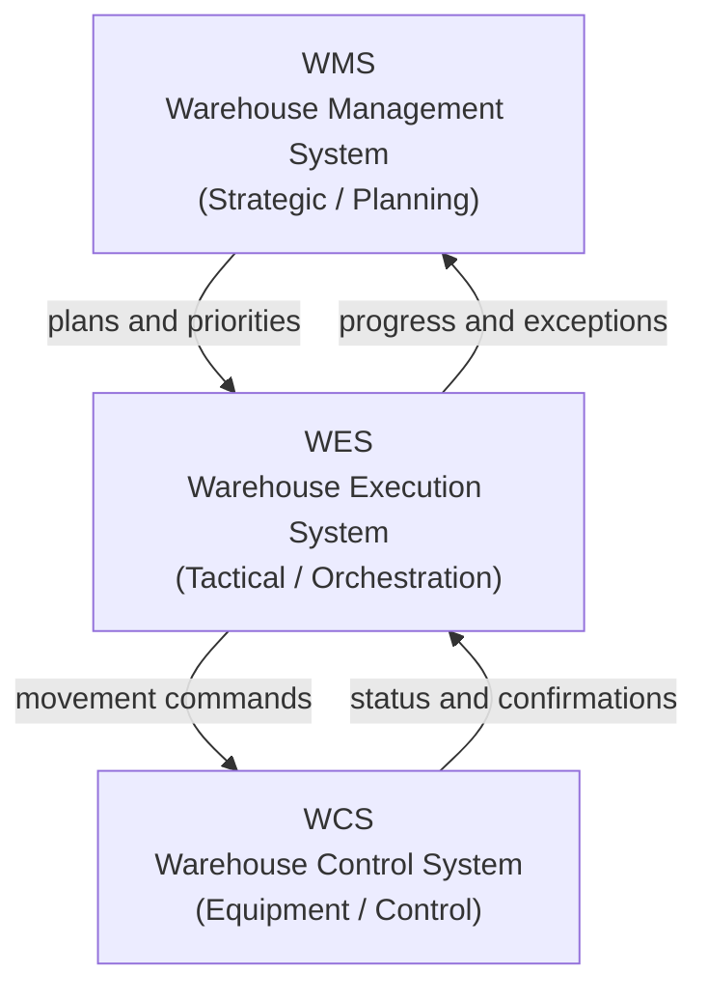
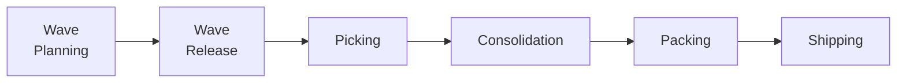
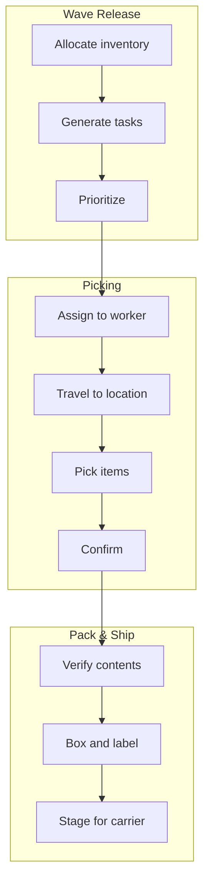
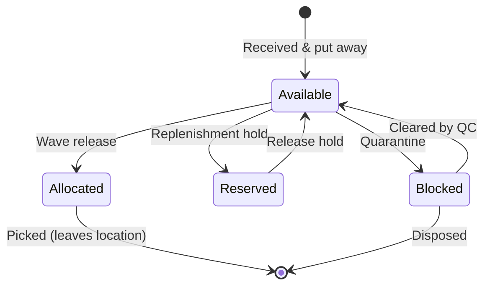

# What Is a Warehouse Execution System?

When a customer clicks "Buy," a chain of physical events begins in a warehouse
somewhere. A worker walks to a shelf, picks up an item, places it in a tote,
and sends it on its way to a packing station. Multiply that by thousands of
orders per hour, and you begin to see the challenge: coordinating all of this
movement in real time, with the right priorities, across dozens of workers and
zones, without losing track of a single unit of inventory.

This chapter is about that world. We will not look at any code yet. Instead, we
will build a shared vocabulary for the warehouse domain so that when we do start
reading and writing code, every type name and every state transition will
already feel familiar.

Whether you have spent years in logistics or have never set foot in a
warehouse, this chapter will give you the mental model you need to understand
what Neon WES does, and why it exists.


## From Shelf to Ship: The Life of a Warehouse Order

Let's follow a single customer order through a warehouse, from the moment the
goods first arrive to the moment the package leaves on a delivery truck.

**Inbound.** A supplier's truck pulls up to a receiving dock. Workers unload
pallets and cases, scan barcodes, and verify quantities against a purchase
order. Once checked in, the goods need a home. A putaway process assigns each
item to a storage location based on rules like product type, how frequently the
item sells, and whether it requires climate control. The items are now "on
hand" and available for future orders.

**Storage.** The warehouse is not a single room; it is a network of zones,
aisles, racks, and individual bin positions. Fast-moving items live close to
packing stations. Bulky or slow-moving items sit further away. This
organization is deliberate: every meter a picker walks is time and money.

**Outbound.** A customer places an order. The system groups that order with
others heading to the same carrier or region, allocates inventory, and
generates a list of pick tasks. Workers fan out across the warehouse, collect
the items, and bring them to a consolidation point. There, a packer verifies
the contents, boxes the order, prints a shipping label, and stages the package
for carrier pickup.

That is the entire lifecycle at a high level. The rest of this chapter digs
into each piece.


## WES, WMS, and WCS: The Three-Layer Hierarchy

Warehouse technology is often described as a three-layer stack. Each layer has a
distinct responsibility, and the boundaries between them are well understood in
the industry.



### WMS: The Strategic Layer

A *Warehouse Management System* is the planning brain. It manages inventory
records, processes inbound and outbound orders, defines storage strategies, and
tracks everything at a high level. If you ask "What inventory do we have, and
what is our plan?", the WMS answers.

A WMS decides *what* needs to happen. It does not concern itself with *how* or
*when* at a granular, real-time level.

### WES: The Tactical Layer

A *Warehouse Execution System* sits between planning and equipment. It takes
the WMS's plan and turns it into real-time action: batching orders into waves,
prioritizing tasks, directing workers and material flow, and reacting to
exceptions as they happen. If you ask "In what sequence and with what resources
should we execute the plan right now?", the WES answers.

This is the layer Neon WES occupies.

### WCS: The Equipment Layer

A *Warehouse Control System* talks directly to physical equipment: conveyors,
sorters, robotic arms, automated storage and retrieval systems. If you ask "How
should this specific piece of equipment behave right now?", the WCS answers.

A WCS operates at the millisecond level. It tracks the position of every tote
on a conveyor loop, controls divert gates, and manages traffic so that
equipment runs smoothly without collisions or jams.

### Where the Boundaries Blur

In practice, these layers are not always separate products. Many modern systems
combine WES and WCS into a single platform, especially in highly automated
warehouses. Some WMS products include execution features. Neon WES focuses on
the middle layer, and it communicates with systems above and below through
well-defined interfaces.

> **Note:** You may also encounter the term *MFC (Material Flow Controller)*,
> which is essentially a synonym for WCS in some vendor ecosystems.


## Core Warehouse Concepts

Before we walk through the outbound and inbound flows in detail, let's
establish the core vocabulary. These terms will appear throughout the rest of
the book and directly map to types and modules in the Neon codebase.

### Orders and Order Lines

An *order* represents a customer's request to receive goods. Each order
contains one or more *order lines*, where each line specifies a product and a
quantity. For example, an order might have three lines: 2 units of product A, 1
unit of product B, and 5 units of product C.

In the warehouse, an order is not a single physical thing. It is a logical
grouping that the system must decompose into concrete work.

### SKUs

A *SKU* (Stock Keeping Unit) is a unique identifier for a product in the
warehouse. The same physical product might have different SKUs if it comes in
different packaging sizes or configurations. The SKU record carries information
the warehouse needs: dimensions, weight, whether the item is fragile or
hazardous, and the *unit of measure hierarchy* (each = inner pack = case =
pallet).

### Locations

A *location* is any named position in the warehouse where inventory can reside.
Locations form a hierarchy:

- **Zone**: a logical area (e.g., "ambient storage," "cold room," "mezzanine")
- **Aisle**: a corridor between racks
- **Rack**: a vertical shelving structure
- **Bin**: an individual slot within a rack

A single bin might hold one SKU or several, depending on the warehouse's
storage strategy. The location hierarchy matters because it drives how the
system groups and routes work. Picking tasks in the same zone can be batched
together; tasks that span zones require a consolidation step.

### Handling Units

A *handling unit* is a physical container that holds inventory. Common handling
units include:

- **Totes**: small bins that travel on conveyors or carts
- **Cases**: cardboard boxes, often from a supplier
- **Pallets**: wooden or plastic platforms carrying stacked cases

Handling units are tracked by the system because they move. When a picker
places three items into a tote, the system records what is in that tote, where
the tote is, and where it is going.

### Waves

A *wave* is a batch of orders that the warehouse processes together. Instead of
handling each order one at a time, the system groups orders by criteria like
carrier cutoff time, shipping priority, or destination zone. This grouping
enables more efficient picking because workers can collect items for many orders
in a single pass through the warehouse.

Waves have a lifecycle: they are planned, released (which triggers inventory
allocation and task generation), and eventually completed or cancelled.

### Tasks

A *task* is the atomic unit of warehouse work. At its simplest, a task says:
"Pick 3 units of SKU X from location A and place them in handling unit Y." The
system generates tasks, allocates inventory against them, assigns them to
workers, and tracks their completion.

Tasks are not limited to picking. A putaway task tells a worker to move a
pallet from receiving to a storage location. A replenishment task restocks a
forward pick face from a reserve location. But in the outbound flow, pick tasks
are the most common type.

### Carriers

A *carrier* is a shipping company responsible for transporting orders from the
warehouse to the end customer. Carriers have service levels, cutoff times, and
pickup schedules that influence wave planning. If a carrier's truck departs at
3 PM, all orders destined for that carrier must be picked, packed, and staged
before then.


## The Outbound Flow

The outbound flow is the warehouse's main event. It transforms customer orders
into shipped packages. Let's walk through each stage.



### Wave Planning

Wave planning is the act of deciding which orders to process together. The
planner (a human or an algorithm) groups orders by criteria such as:

- **Carrier and service level**: all next-day orders for Carrier X
- **Priority**: rush orders before standard orders
- **Zone affinity**: orders that draw from the same warehouse zone
- **Cutoff time**: orders that must ship by a specific deadline

The result is a wave: a named batch of orders, still in a *planned* state,
waiting to be released.

### Wave Release

When a wave is released, three things happen in rapid succession:

1. **Inventory allocation**: the system commits (allocates) on-hand inventory
   to each order line. Available stock decreases; allocated stock increases.
2. **Task generation**: for each allocation, the system creates a pick task
   with a source location, a target handling unit, and a quantity.
3. **Task prioritization**: tasks are ordered by criteria such as zone sequence,
   pick path optimization, and priority.

If there is not enough inventory to fulfill every line, the system must decide
what to do. Some warehouses short-ship (fulfill what they can). Others hold the
entire order until stock arrives. This is a policy decision that varies by
business rules.

### Picking

Picking is the physical act of collecting items. There are several picking
strategies, and a warehouse may use more than one:

- **Discrete picking**: one worker picks one order at a time. Simple but
  inefficient for high-volume operations.
- **Batch picking**: one worker picks items for multiple orders simultaneously,
  then sorts them later. Reduces travel time.
- **Zone picking**: the warehouse is divided into zones, and each worker picks
  only within their assigned zone. Items from different zones are consolidated
  afterward.
- **Cluster picking**: a worker carries a cart with multiple totes, each
  representing a different order. As they walk the pick path, they place items
  directly into the correct tote.

The WES is responsible for assigning tasks to workers and presenting them in an
optimal sequence.

### Consolidation

When orders span multiple warehouse zones (and they often do), the items
picked from each zone must be brought together before packing. This step is
called *consolidation*.

A common approach uses a *put wall*: a rack of cubbies where each cubby
represents one order. Workers arriving from different zones scan their totes and
place items into the correct cubbies. When all items for an order have arrived,
the order is ready for packing.

> **Note:** Consolidation is one of the most complex orchestration challenges
> in a warehouse. The WES must track which items have arrived, which are still
> in transit, and when an order is complete, all while managing limited put-wall
> capacity.

### Packing

At a packing station, a worker verifies the order contents (scanning each
item), selects or is assigned an appropriate box size, adds any required
packing material, seals the box, and prints a shipping label. The system
records that the order has been packed and generates any required shipping
documentation.

### Shipping

Packed orders are staged in a shipping area, organized by carrier and
destination. When the carrier arrives, the orders are loaded onto the truck.
The system records the shipment and sends tracking information upstream.




## The Inbound Flow

While the outbound flow gets most of the attention, the inbound flow is what
keeps the warehouse stocked. Without efficient inbound processes, the outbound
flow grinds to a halt.

### Receiving

Goods arrive at the warehouse on supplier trucks. The truck is directed to a
receiving dock, workers unload pallets and cases to a staging area, and each
item is scanned and checked against the *purchase order* (PO). Quantities,
SKUs, and lot numbers are compared. Discrepancies are flagged.

### Inspection

Depending on the industry, received goods may require quality inspection before
entering active inventory. This is critical in regulated industries like food
and pharmaceuticals. Items that fail inspection are quarantined in a blocked
state until disposition is determined.

### Putaway

Once goods pass receiving (and optional inspection), the system assigns them a
storage location. This decision is not random. *Putaway* rules consider product
type (hazardous materials go to approved zones), velocity (fast-moving SKUs
near pick faces), rotation (older stock positioned for earlier picking), and
space utilization.

A putaway task directs a worker to move goods from receiving to the assigned
location. Once confirmed, the inventory is recorded and becomes available for
future orders.


## Inventory: The Four-Bucket Stock Model

If you think of inventory as a simple count ("we have 50 units of SKU X at
location Y"), you will quickly run into problems. What if 20 of those units are
already promised to an order that has not been picked yet? What if 5 are
quarantined due to damage? A naive count of 50 would overstate what is actually
available.

This is why warehouse systems track inventory in multiple *buckets* at each
location. Neon WES uses a four-bucket model:

| Bucket | Meaning |
|---|---|
| *Available* | Free to be allocated to new orders |
| *Allocated* | Committed to a specific order or task, but not yet physically picked |
| *Reserved* | Held for a specific purpose, such as replenishment or a VIP order |
| *Blocked* | Quarantined, damaged, expired, or otherwise on hold |

The fundamental invariant is:

```
available + allocated + reserved + blocked = on-hand quantity
```

This invariant must hold at all times. When a wave is released and inventory is
allocated, units move from the available bucket to the allocated bucket. When a
pick is completed, units leave the allocated bucket (they have physically left
the location). When damaged goods are quarantined, units move from available to
blocked.



### Lot Tracking

Many industries require tracking goods at a granularity finer than the SKU
level. A *lot* (sometimes called a batch) identifies a specific production run
of a product. Lot tracking enables recalls, quality investigations, and
rotation-based picking.

The GS1 standard defines *Application Identifiers* (AIs) for encoding lot
information in barcodes:

- **AI 10**: Batch or lot number
- **AI 17**: Expiration date (YYMMDD format)

When goods are received, the system captures these identifiers. They stay with
the inventory throughout its lifecycle in the warehouse.

### Allocation Strategies: FEFO and FIFO

When the system allocates inventory to an order, it must decide *which* stock
to use when multiple lots of the same SKU are available. Two common strategies
are:

- *FEFO* (First Expired, First Out): allocate the lot with the earliest
  expiration date first. This is mandatory in food and pharmaceutical
  warehouses to prevent products from expiring on the shelf.
- *FIFO* (First In, First Out): allocate the lot that was received earliest.
  This is appropriate for products without expiration dates but where age-based
  rotation is still desired.

The choice between FEFO and FIFO is typically configured per SKU or product
category.

### Shortpicks

A *shortpick* occurs when a worker arrives at a location to pick a certain
quantity but finds fewer units than the system expected. This is one of the most
disruptive events in a warehouse because it breaks the plan.

When a shortpick happens, the WES must decide: should it reallocate from
another location, short-ship the order, reassign the task, or correct the
inventory count? These decisions are governed by *shortpick policies*, and
different warehouses handle them differently.

### Cycle Counting

Warehouses cannot shut down for a full physical inventory count. Instead, they
use *cycle counting*: continuously auditing small subsets of inventory on a
rotating basis. A cycle count task directs a worker to a location, asks them to
count what they find, and compares the result to the system record.

Common triggers include scheduled rotation (every location counted on a
calendar), shortpick follow-ups (an immediate count at the affected location),
and velocity-based counting (high-activity locations counted more frequently).


## Why Event Sourcing for a Warehouse?

We have spent this chapter describing warehouse operations in terms of things
that happen: goods *received*, inventory *allocated*, items *picked*, orders
*shipped*. This is not a coincidence. Warehouse operations are inherently
event-driven. Every meaningful change in the warehouse is a discrete,
observable event.

This is why Neon WES uses *event sourcing* as its persistence model. Let's
look at why this is a natural fit rather than a forced technical choice.

### Operations Are Already Events

Consider the lifecycle of a single pick task: created, allocated, assigned to a
worker, confirmed, completed. Each step is a distinct event with a timestamp,
an actor, and a payload. In a traditional system, you might store only the
current state (a row with a "status" column). With event sourcing, you store
every event, and the current state is derived by replaying them.

### Auditability

Warehouses that handle food, pharmaceuticals, or controlled substances face
strict regulatory requirements. Auditors need to know exactly what happened to
every item: who picked it, when, from which location, and which lot. An
event-sourced system provides a complete, immutable audit trail by
construction. You do not need to bolt on audit logging after the fact; it is
the system's primary data model.

### Temporal Queries

"What was the inventory at location A-03-12 at 3 PM yesterday?" In a
traditional system, answering this question requires specialized audit tables
or temporal database features. In an event-sourced system, you replay events up
to the desired timestamp. The answer falls out naturally.

This capability is invaluable for investigating shortpicks, reconciling
discrepancies, and understanding how a particular situation arose.

### Replay and Recovery

If a read-side projection becomes corrupted or needs restructuring, you rebuild
it from the event log. When you add a new reporting view, you replay existing
events through a new projection handler and get a fully populated read model
without any data migration.

### Conflict-Free Writes

During a wave release, the system may update hundreds of inventory records and
create hundreds of tasks in a short burst. In a traditional row-based system,
this causes lock contention. An event-sourced, actor-based system sidesteps the
problem: each entity processes commands through its own actor, and writes are
append-only. There are no row-level locks to contend over.

### The Natural Model

Event sourcing is sometimes criticized as adding unnecessary complexity. In the
warehouse domain, the opposite is true. The domain *already thinks in events*.
Warehouse workers speak in events: "I picked it," "I received it," "I put it
away." The event log is not an engineering abstraction imposed on the domain;
it is a direct representation of how the warehouse actually operates.

> **Note:** If you are new to event sourcing, do not worry about the
> implementation details yet. Chapter 2 will set up the development environment,
> and later chapters will walk through the code step by step. For now, the key
> takeaway is that the technical architecture grows directly out of the domain's
> natural structure.


## What Comes Next

Now that we have a shared vocabulary for the warehouse domain, we are ready to
get our hands dirty. In Chapter 2, we will set up the development environment,
explore the project structure, and see how the concepts from this chapter map
to modules, types, and state machines in the Neon WES codebase.
