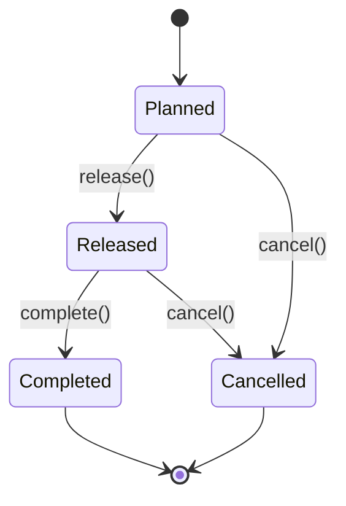
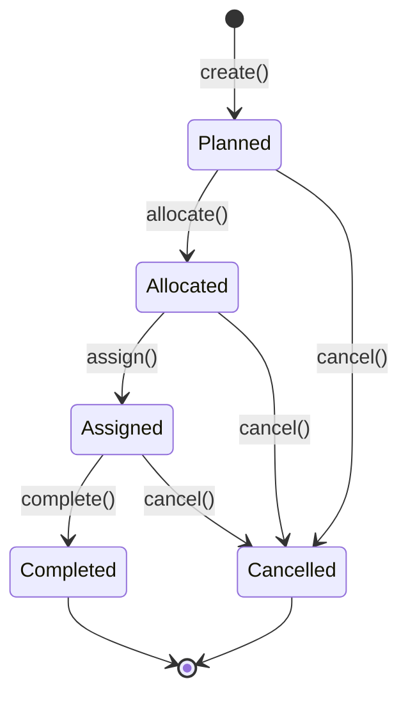
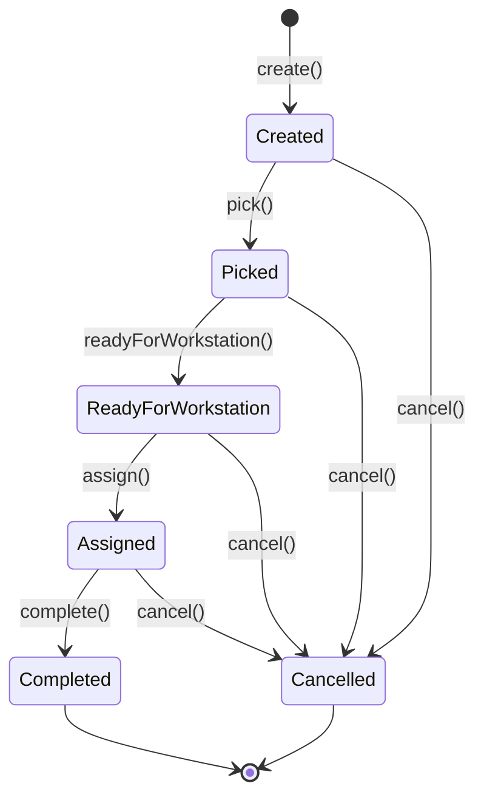
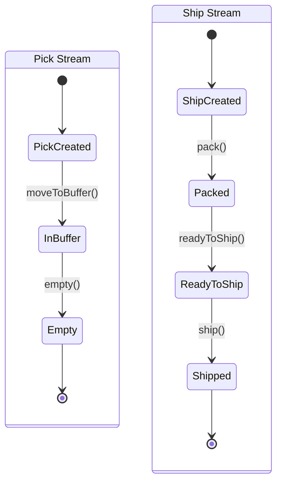
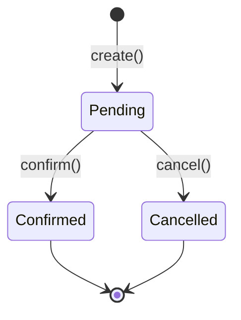
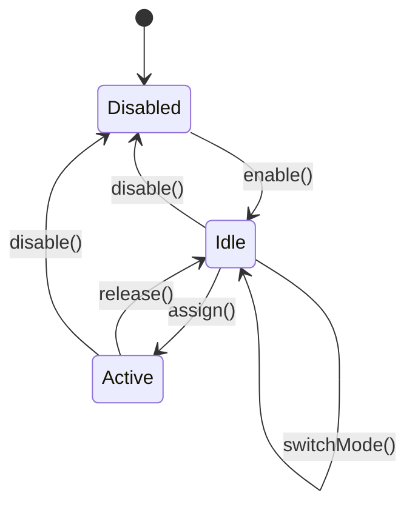
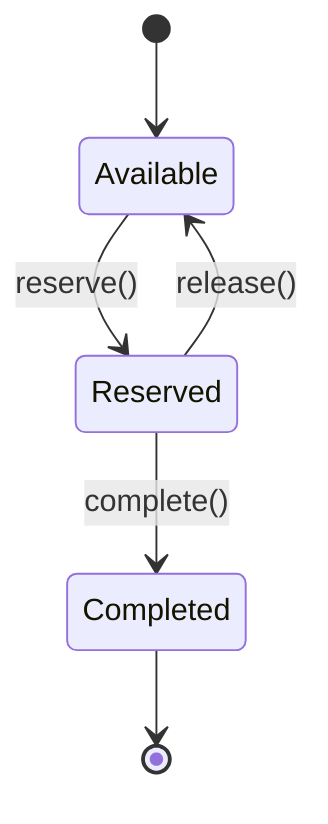

# Modeling State with Typestates

A task in a warehouse moves through a well-defined lifecycle: it is planned,
allocated to a location, assigned to a worker, and then completed. What happens
if our code tries to assign a worker to a task that has not been allocated yet?
In a typical codebase, the answer is a runtime exception, discovered in testing
if you are lucky and in production if you are not. In this chapter, we will
learn how Neon WES makes that mistake impossible at compile time.

In Chapter 3 we built the shared foundation: opaque type IDs, enums, and utility
types. Those are the nouns of our domain. Now it is time to give them behavior,
to model how entities change over time and to make illegal transitions
unrepresentable in code.


## The State Machine Problem

Every domain aggregate in a warehouse system has a lifecycle. A wave is planned,
then released, then completed. A task is planned, allocated, assigned, and
completed. These lifecycles are state machines, and the most straightforward way
to model them is with a status field and runtime checks.

Here is a naive approach:

```scala
// The fragile approach
case class Task(id: TaskId, status: String, assignedTo: Option[UserId]):
  def assign(userId: UserId): Task =
    if status != "allocated" then
      throw IllegalStateException("Cannot assign")
    else copy(status = "assigned", assignedTo = Some(userId))
```

This compiles. It might even work most of the time. But it has three serious
problems:

1. **The status is stringly typed.** A typo like `"alocated"` will not be caught
   until runtime. You could use an enum to fix this specific issue, but the
   deeper problem remains.

2. **Every transition method is available on every instance.** Nothing in the
   type system prevents calling `assign()` on a completed task. The method
   exists; the check is inside the body. You have to read the implementation to
   know which calls are valid.

3. **The compiler cannot help you.** Tests can catch invalid transitions if you
   remember to write them. But the type system, which could verify these rules
   across your entire codebase for free, sits idle.

We can do better.


## Typestate Encoding in Scala 3

The idea behind *typestate encoding* is simple: instead of representing the
lifecycle as a single type with a status field, we represent each state as its
own type. Transition methods exist only on the types where they are valid. If
you try to call a method that does not belong to the current state, the code
does not compile.

Neon WES uses three building blocks for every typestate-encoded aggregate:

1. **A sealed trait as the universe of all states.** This is the base type that
   the rest of the system can reference when it needs "a Task in any state."

2. **Case classes nested in the companion object, one per state.** Each case
   class carries exactly the fields that make sense in that state.

3. **Transition methods that return `(NewState, Event)` tuples.** Every state
   change produces both a new instance in the target state and an event recording
   what happened.

Let's see how this works in practice.


## Your First Aggregate: Wave

A wave groups orders for batch processing through the warehouse. Its lifecycle
is the simplest in Neon WES: planned, released, completed, or cancelled. Here
is the state diagram:



And here is the code:

```scala
@JsonTypeInfo(use = JsonTypeInfo.Id.CLASS)
sealed trait Wave:
  def id: WaveId
  def orderGrouping: OrderGrouping

object Wave:

  case class Planned(
      id: WaveId,
      orderGrouping: OrderGrouping,
      orderIds: List[OrderId]
  ) extends Wave:

    def release(at: Instant): (Released, WaveEvent.WaveReleased) =
      val released = Released(id, orderGrouping, orderIds)
      val event = WaveEvent.WaveReleased(id, orderGrouping, orderIds, at)
      (released, event)

    def cancel(at: Instant): (Cancelled, WaveEvent.WaveCancelled) =
      val cancelled = Cancelled(id, orderGrouping)
      val event = WaveEvent.WaveCancelled(id, orderGrouping, at)
      (cancelled, event)

  case class Released(
      id: WaveId,
      orderGrouping: OrderGrouping,
      orderIds: List[OrderId]
  ) extends Wave:

    def complete(at: Instant): (Completed, WaveEvent.WaveCompleted) =
      val completed = Completed(id, orderGrouping)
      val event = WaveEvent.WaveCompleted(id, orderGrouping, at)
      (completed, event)

    def cancel(at: Instant): (Cancelled, WaveEvent.WaveCancelled) =
      val cancelled = Cancelled(id, orderGrouping)
      val event = WaveEvent.WaveCancelled(id, orderGrouping, at)
      (cancelled, event)

  case class Completed(id: WaveId, orderGrouping: OrderGrouping) extends Wave

  case class Cancelled(id: WaveId, orderGrouping: OrderGrouping) extends Wave
```

<small>*File: wave/src/main/scala/neon/wave/Wave.scala*</small>

Let's break this down piece by piece.

### The sealed trait

The `sealed trait Wave` defines the *universe* of all wave states. Any code
that accepts a `Wave` can receive a wave in any state. The trait declares the
fields common to every state: `id` and `orderGrouping`.

The `sealed` keyword is critical. It tells the compiler that all subtypes of
`Wave` are defined in this file and nowhere else. This makes pattern matching
exhaustive: if you forget to handle a state, the compiler warns you.

### The annotations

The `@JsonTypeInfo(use = JsonTypeInfo.Id.CLASS)` annotation tells the
serialization layer to include the concrete class name when serializing a
`Wave` value. Without it, a snapshot containing a `Wave.Released` would be
deserialized as a bare `Wave`, losing the state information. We will revisit
serialization in Chapter 17; for now, just know that every typestate-encoded
aggregate needs this annotation.

In the actual source file, the sealed trait also extends `CborSerializable`,
the marker trait from Chapter 3. We omit it from the listing to keep the
focus on the typestate structure.

### The `Planned` state and its transitions

`Planned` carries `orderIds` because a planned wave still knows which orders it
contains. It exposes two transition methods: `release()` and `cancel()`. Each
returns a tuple of `(NewState, Event)`.

Look at the return type of `release()`: it is `(Released, WaveEvent.WaveReleased)`.
Not `(Wave, WaveEvent)`. The return type is as specific as possible. The caller
knows, at the type level, that the result is a `Released` wave.

`Released` has its own transition methods: `complete()` and `cancel()`. Notice
what it does *not* have: a `release()` method. You cannot release a wave that
is already released. The compiler enforces this.

### Terminal states and cancellation

`Completed` and `Cancelled` are *terminal states*. They have no transition
methods at all. The case class declarations have no body. There is nothing you
can do with a completed or cancelled wave except read its fields.

Notice that terminal states carry fewer fields. `Completed` and `Cancelled`
no longer hold `orderIds`. The orders were relevant during planning and
execution, but once the wave reaches a terminal state, that data has served its
purpose.

Both `Planned` and `Released` define a `cancel()` method. This is deliberate:
a wave can be cancelled from any non-terminal state. Rather than sharing a
method through inheritance (which would weaken the typestate guarantees), each
state declares its own `cancel()`. A small amount of duplication buys a large
amount of clarity.


## A More Complex Aggregate: Task

With the Wave pattern established, let's look at `Task`, which has a longer
lifecycle and richer fields. Here is the state diagram:



### The sealed trait and factory method

```scala
@JsonTypeInfo(use = JsonTypeInfo.Id.CLASS)
sealed trait Task:
  def id: TaskId
  def taskType: TaskType
  def skuId: SkuId
  def orderId: OrderId
  def waveId: Option[WaveId]
  def handlingUnitId: Option[HandlingUnitId]
  def stockPositionId: Option[StockPositionId]

object Task:

  def create(
      taskType: TaskType,
      skuId: SkuId,
      packagingLevel: PackagingLevel,
      requestedQuantity: Int,
      orderId: OrderId,
      waveId: Option[WaveId],
      parentTaskId: Option[TaskId],
      handlingUnitId: Option[HandlingUnitId],
      at: Instant,
      stockPositionId: Option[StockPositionId] = None
  ): (Planned, TaskEvent.TaskCreated) =
    require(requestedQuantity > 0,
      s"requestedQuantity must be positive, got $requestedQuantity")
    val id = TaskId()
    val planned = Planned(id, taskType, skuId, packagingLevel,
      requestedQuantity, orderId, waveId, parentTaskId,
      handlingUnitId, stockPositionId)
    val event = TaskEvent.TaskCreated(id, taskType, skuId, packagingLevel,
      orderId, waveId, parentTaskId, handlingUnitId,
      requestedQuantity, at, stockPositionId)
    (planned, event)
```

<small>*File: task/src/main/scala/neon/task/Task.scala*</small>

Unlike `Wave`, `Task` has a `create()` factory method on the companion object.
This is where *precondition validation* lives. The `require()` call ensures
that `requestedQuantity` is positive. If someone passes zero or a negative
number, they get a clear failure immediately, not a corrupted aggregate that
silently misbehaves later.

The factory method also generates a fresh `TaskId()` internally, using the
UUID v7 generator from Chapter 3. Callers never need to supply an ID.

> **Note:** The `require()` function throws an `IllegalArgumentException` if
> the condition is false. This is one of the few places in Neon WES where an
> exception is used. It is acceptable here because violating a precondition
> represents a programming error, not a domain error.

### Fields accumulate as the state progresses

This is one of the most important patterns to notice. Compare the fields across
the four non-terminal states:

| State | New fields added |
|---|---|
| `Planned` | `id`, `taskType`, `skuId`, `packagingLevel`, `requestedQuantity`, `orderId`, `waveId`, `parentTaskId`, `handlingUnitId`, `stockPositionId` |
| `Allocated` | `sourceLocationId`, `destinationLocationId` |
| `Assigned` | `assignedTo` (a `UserId`) |
| `Completed` | `actualQuantity` |

Each transition adds the information that becomes available at that stage. A
planned task does not know its source location yet, because allocation has not
happened. An allocated task does not know who will execute it, because
assignment has not happened. The type system reflects this reality: you simply
cannot access `sourceLocationId` on a `Planned` task because the field does not
exist on that type.

### The transition chain

Each transition method accepts the new information that becomes available at
that stage and constructs the next state. `allocate()` takes source and
destination locations. `assign()` takes a `UserId`. `complete()` takes the
`actualQuantity` that was physically picked:

```scala
case class Assigned(...) extends Task:

  def complete(actualQuantity: Int, at: Instant)
      : (Completed, TaskEvent.TaskCompleted) =
    require(actualQuantity >= 0,
      s"actualQuantity must be non-negative, got $actualQuantity")
    ...
```

Notice the second `require()`: the actual quantity must be non-negative. A
zero is valid (it represents a full shortpick where the worker found nothing
at the location), but a negative quantity is a programming error.

### Cancellation from any non-terminal state

Like `Wave`, every non-terminal task state has a `cancel()` method. But
`Task.Cancelled` is more interesting than `Wave.Cancelled`:

```scala
case class Cancelled(
    id: TaskId,
    taskType: TaskType,
    skuId: SkuId,
    packagingLevel: PackagingLevel,
    orderId: OrderId,
    waveId: Option[WaveId],
    parentTaskId: Option[TaskId],
    handlingUnitId: Option[HandlingUnitId],
    stockPositionId: Option[StockPositionId],
    sourceLocationId: Option[LocationId],
    destinationLocationId: Option[LocationId],
    assignedTo: Option[UserId]
) extends Task
```

The location and user fields are `Option` types. This is because cancellation
can happen from `Planned` (before locations are known), from `Allocated`
(before a user is assigned), or from `Assigned` (when both are known). The
`Cancelled` state must accommodate all three entry points. Each `cancel()`
method fills in the optional fields with `Some(...)` or `None` depending on
what was available at the time.

This is a pragmatic choice. An alternative would be to have separate cancelled
states (`CancelledFromPlanned`, `CancelledFromAllocated`,
`CancelledFromAssigned`), but in practice the downstream code treats all
cancelled tasks the same way. A single `Cancelled` type with optional fields
keeps the model simple without losing information.


## The Full Catalogue of State Machines

Neon WES has eight event-sourced aggregates. We have already examined Wave and
Task in detail. Let's survey the remaining six.

### ConsolidationGroup

A consolidation group batches orders from a wave for workstation processing.
It has the longest linear chain in the system: five states before the terminals.



<small>*File: consolidation-group/src/main/scala/neon/consolidationgroup/ConsolidationGroup.scala*</small>

The states track the physical flow: the group is created when a wave is
released, marked as picked when all pick tasks finish, becomes ready for a
workstation when all handling units arrive at the consolidation buffer, gets
assigned to a specific workstation, and completes after deconsolidation and
packing. Each transition method adds context. `Assigned` acquires a
`workstationId`, and `Completed` retains it so we know where the work was done.

Like `Task`, the factory method validates preconditions:

```scala
def create(
    waveId: WaveId,
    orderIds: List[OrderId],
    at: Instant
): (Created, ConsolidationGroupEvent.ConsolidationGroupCreated) =
  require(orderIds.nonEmpty, "orderIds must not be empty")
  ...
```

A consolidation group without orders would be meaningless, so the `require()`
catches it at creation time.

### HandlingUnit

The handling unit is unique among Neon's aggregates: it has two independent
lifecycles under a single sealed trait.



<small>*File: handling-unit/src/main/scala/neon/handlingunit/HandlingUnit.scala*</small>

The *pick stream* models a tote that carries picked items from the pick face
to a consolidation buffer, where it is eventually emptied during deconsolidation.
The *ship stream* models a shipping container that gets packed at a workstation,
marked ready, and eventually shipped.

The two streams share the `HandlingUnit` sealed trait and its common fields
(`id` and `packagingLevel`), but their state types are entirely separate. A
`PickCreated` handling unit has no `pack()` method, and a `ShipCreated`
handling unit has no `moveToBuffer()` method. The type system keeps the two
streams from interfering with each other.

### TransportOrder

The transport order is the simplest aggregate in the system: just two states
plus a terminal pair.



<small>*File: transport-order/src/main/scala/neon/transportorder/TransportOrder.scala*</small>

A transport order represents the instruction to move a handling unit to a
destination. It is created by routing policies when a task completes, modeling
the temporal gap between "the task is done" and "the operator confirmed arrival
at the destination." Once confirmed or cancelled, the order is finished.

Simplicity is a virtue here. Not every aggregate needs a long lifecycle. The
transport order captures exactly one decision point (confirm or cancel) and
nothing more.

### Workstation

The workstation breaks a pattern we have seen in every aggregate so far: its
lifecycle is *cyclical*, not one-directional.



<small>*File: workstation/src/main/scala/neon/workstation/Workstation.scala*</small>

A workstation can cycle between `Idle` and `Active` many times during a shift
as consolidation groups are assigned and completed. It can also be disabled
(taken offline) from either `Idle` or `Active`, and re-enabled later.

The `switchMode()` method on `Idle` is another novelty: a transition that
returns to the same state type but with different data. The workstation's
`WorkstationMode` changes (for example, from `Picking` to `Packing`), but the
lifecycle position does not.

There is no `Completed` or `Cancelled` terminal here. Workstations are
long-lived resources. They are enabled, used, disabled, and enabled again.
The typestate pattern accommodates cyclical lifecycles just as naturally as
linear ones.

### Slot

A slot is a put-wall position within a workstation, and its lifecycle includes
a backwards transition.



<small>*File: slot/src/main/scala/neon/slot/Slot.scala*</small>

The interesting feature is `release()` on `Reserved`, which transitions back to
`Available`. This supports pre-placement cancellation: if the consolidation
group assigned to the workstation is cancelled before items have been placed in
the slot, the slot returns to the available pool. Like the workstation's cyclical
lifecycle, this demonstrates that typestate encoding is not limited to strictly
forward-moving state machines.


## Patterns and Principles

Having examined six aggregates, we can now identify the recurring patterns that
make this approach consistent and maintainable.

### Terminal states have no methods

`Completed`, `Cancelled`, `Shipped`, `Empty`, `Confirmed`: every terminal state
is a case class with no body. There are no transition methods to call. This is
the strongest possible guarantee. You do not need to check a flag or read
documentation to know that a completed task cannot be assigned. The type tells
you: there is nothing to call.

### Cancellation from any non-terminal state

With the exception of aggregates that do not use a cancellation concept
(workstations cycle through modes; slots release back to available), every
non-terminal state defines a `cancel()` method. This reflects a real warehouse
constraint: operations can be interrupted at any point, and the system must
handle it gracefully.

### Fields accumulate

Later states carry more information than earlier ones. `Task.Planned` has no
location fields. `Task.Allocated` adds source and destination. `Task.Assigned`
adds the user. `Task.Completed` adds the actual quantity. Each transition
enriches the aggregate with the data that becomes available at that stage.

This is not just a modeling choice; it is a documentation feature. By reading
the case class fields, you know exactly what information is available at each
point in the lifecycle without consulting any external documentation.

### `require()` for creation-time invariants

Factory methods use `require()` to enforce invariants that must hold when an
aggregate is born. A task must have a positive quantity. A consolidation group
must have at least one order. These checks fail fast with clear messages,
preventing corrupted aggregates from entering the system.

### The `(NewState, Event)` tuple

Every transition method returns a tuple containing the new state and the event
that records the transition. This dual return is a defining feature of the
pattern. The state represents what the aggregate *is* now. The event represents
what *happened*. Both are needed: the state for further transitions, the event
for persistence and downstream reactions.

We will explore events in depth in the next chapter.


## Architecture Note: The Decider Pattern

Readers familiar with functional event sourcing may recognize a resemblance to
Jermaine Chassaing's *Decider pattern*. In the Decider, two functions drive the
lifecycle:

- `decide(command, state) -> List[Event]` produces events from commands
- `evolve(state, event) -> State` reconstructs state from events

Neon's typestate methods fuse `decide` and `evolve` into a single call. When
you call `planned.release(at)`, you get back both the new state (what `evolve`
would produce) and the event (what `decide` would produce). The method *is*
both functions at once.

This fusion trades the Decider's compositional algebra for compile-time state
enforcement. In the Decider pattern, `decide` accepts any command on any state
and returns events (or an empty list for invalid transitions). In the typestate
pattern, invalid transitions do not exist as callable methods. The trade-off
is worth it for domain aggregates where the state machine is well-defined and
the set of states is known at compile time.

That said, the full Decider structure reappears at the infrastructure layer.
In Chapter 10, we will see how Pekko's `EventSourcedBehavior` separates command
handling (the `decide` role) from event handling (the `evolve` role), giving us
the best of both worlds: compile-time safety in the domain model, and the
Decider's clean separation in the actor layer.


## What Comes Next

We have seen that every transition method returns a tuple containing the new
state and an event. But what exactly are these events, and why do they matter?
In the next chapter, we will open up the event types, understand their
structure, and see how they become the source of truth for the entire system.
