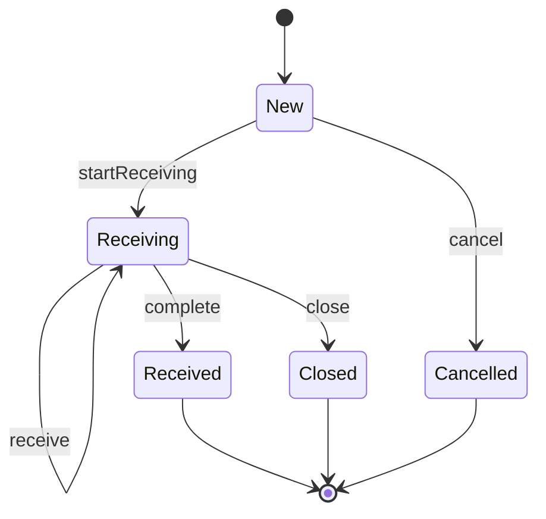
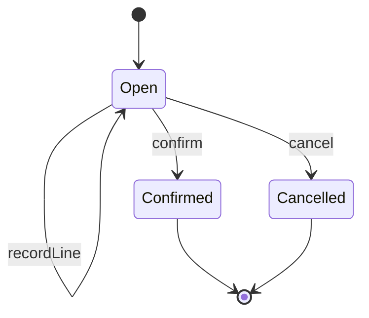
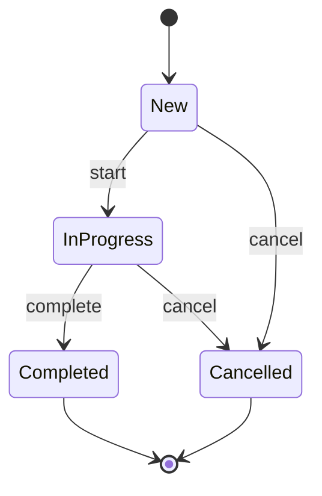
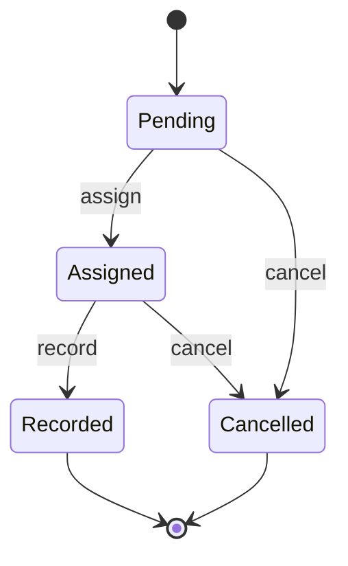

# Inbound and Cycle Counting

Stock does not appear in a warehouse by magic. It arrives on trucks, gets
inspected, and enters the system through a controlled receiving process. And
once it is in, the system must periodically verify that physical reality still
matches the digital record. These two flows, inbound receiving and cycle
counting, form the bookends of inventory accuracy.

In this chapter, we will walk through four aggregates that manage these
processes: `InboundDelivery` and `GoodsReceipt` on the inbound side,
`CycleCount` and `CountTask` on the counting side. We will also see how the
core module's services and policies orchestrate the cross-aggregate workflows
that connect receiving to stock and counting to adjustments.


## Inbound Delivery Lifecycle

An `InboundDelivery` represents an expected receipt of goods. It might come from
a purchase order, a transfer from another facility, or a return. The aggregate
tracks the expected quantity and the progress of receiving against it.

The state machine has four states with a clear forward progression:



Let's look at each state and its transitions.

### New

Every inbound delivery starts in the `New` state. At this point, we know which
SKU is expected, the packaging level, the lot attributes, and the expected
quantity:

```scala
case class New(
    id: InboundDeliveryId,
    skuId: SkuId,
    packagingLevel: PackagingLevel,
    lotAttributes: LotAttributes,
    expectedQuantity: Int
) extends InboundDelivery:
  require(expectedQuantity > 0, ...)

  def startReceiving(at: Instant): (Receiving, InboundDeliveryEvent.ReceivingStarted) = ...
  def cancel(at: Instant): (Cancelled, InboundDeliveryEvent.InboundDeliveryCancelled) = ...
```

<small>*File: inbound-delivery/src/main/scala/neon/inbounddelivery/InboundDelivery.scala*</small>

Two transitions are available. If the truck arrives, we call `startReceiving`.
If the delivery is cancelled before any goods arrive (the supplier notifies us,
the PO is voided), we call `cancel`. Notice that cancellation is only possible
from `New`. Once receiving has started, the delivery can only be completed or
closed.

### Receiving

The `Receiving` state is where the work happens. It tracks `receivedQuantity`
and `rejectedQuantity`, with the invariant
`expectedQuantity >= receivedQuantity + rejectedQuantity` preventing
over-receiving. Each call to `receive` records a batch of accepted and rejected
quantities. Three exits from `Receiving`:

- **`receive`** loops back to `Receiving` with updated quantities. This is the
  self-transition, called once per batch inspected.
- **`complete`** moves to `Received` when `isFullyReceived` returns true
  (received + rejected equals expected).
- **`close`** forces a transition to `Closed`, automatically converting all
  remaining unprocessed quantity into rejected. This handles the case where
  receiving needs to be cut short: the truck left, the shift ended, or the
  remaining goods are unsalvageable.

### Terminal States

`Received`, `Closed`, and `Cancelled` are all terminal. They carry the final
tallies but expose no further transitions:

```scala
case class Received(..., receivedQuantity: Int, rejectedQuantity: Int) extends InboundDelivery
case class Closed(..., receivedQuantity: Int, rejectedQuantity: Int) extends InboundDelivery
case class Cancelled(..., expectedQuantity: Int) extends InboundDelivery
```

> **Note:** `Received` and `Closed` both carry `receivedQuantity` and
> `rejectedQuantity`, but they differ in how they got there. `Received` means
> every unit was explicitly accounted for. `Closed` means the system forced
> the remaining balance into the rejected column.


## Goods Receipt

While `InboundDelivery` tracks the *expected* side of receiving, `GoodsReceipt`
tracks the *physical* side. A goods receipt represents a receiving session:
an operator at a dock door scanning and inspecting items as they come off the
truck.



### Recording and Confirming Lines

A `GoodsReceipt.Open` accumulates `ReceivedLine` entries. Each line captures
a SKU, quantity, packaging level, lot attributes, and an optional
`targetContainerId` (linking the receipt to a physical handling unit if items
are scanned directly into a container):

```scala
case class ReceivedLine(
    skuId: SkuId,
    quantity: Int,
    packagingLevel: PackagingLevel,
    lotAttributes: LotAttributes,
    targetContainerId: Option[ContainerId]
)
```

<small>*File: goods-receipt/src/main/scala/neon/goodsreceipt/ReceivedLine.scala*</small>

The operator records lines one at a time via `recordLine`, then calls `confirm`
when finished. Confirmation requires at least one line. The
`GoodsReceiptConfirmed` event carries the full list of received lines, making
it a self-contained record of everything received in this session.


## The Inbound Receiving Service

Confirming a goods receipt triggers a cascade in the core module. The
`InboundReceivingService` orchestrates two things: creating putaway tasks and
updating stock positions.

The service's `processConfirmedReceipt` method takes a confirmed receipt, an
order ID, and an optional stock position ID. It performs two steps:

**Step 1: Create putaway tasks.** The `PutawayCreationPolicy` transforms each
received line into a planned putaway task. Each line maps to exactly one task
with `taskType = TaskType.Putaway` and `waveId = None` (since putaway
originates from the inbound flow, not from wave-driven outbound):

```scala
object PutawayCreationPolicy:

  def apply(
      receivedLines: List[ReceivedLine],
      orderId: OrderId,
      at: Instant
  ): List[(Task.Planned, TaskEvent.TaskCreated)] =
    receivedLines.map: line =>
      Task.create(
        taskType = TaskType.Putaway,
        skuId = line.skuId,
        packagingLevel = line.packagingLevel,
        requestedQuantity = line.quantity,
        orderId = orderId,
        waveId = None,
        ...
      )
```

<small>*File: core/src/main/scala/neon/core/PutawayCreationPolicy.scala*</small>

**Step 2: Optionally update stock.** If a `stockPositionId` is provided, the
service calls `addQuantity` on the corresponding stock position, increasing
both on-hand and available by the total received amount.

> **Note:** The stock position update is optional. Some warehouses update stock
> only after putaway is confirmed (the goods have reached their storage
> location), while others update at receipt time. The optional parameter lets
> the caller choose the appropriate strategy.


## Cycle Count Lifecycle

A `CycleCount` represents a scheduled or ad-hoc inventory verification for a
set of SKUs within a warehouse area. Where inbound receiving adds stock to the
system, cycle counting verifies that what the system believes is physically
there.



Each cycle count carries a `countType` and a `countMethod` that determine how
it was triggered and how the counting is performed.

### Count Types

The `CountType` enum captures four triggering patterns:

| Type        | Description                                   | SAP Equivalent   |
| ----------- | --------------------------------------------- | ---------------- |
| `Planned`   | Standard scheduled count (monthly, quarterly) | Periodic         |
| `Random`    | Random sample for statistical accuracy        | Ad Hoc           |
| `Triggered` | Movement-triggered opportunistic count        | Continuous       |
| `Recount`   | Recount of a prior variance                   | EWM standard     |

### Count Methods

The `CountMethod` enum controls what the counter sees on their device:

- **`Blind`**: the counter does not see the expected quantity. They must count
  from scratch, eliminating confirmation bias. More accurate but slower.
- **`Informed`**: the counter sees the expected quantity and confirms or adjusts
  it. Faster but susceptible to "looks about right" bias.

> **Note:** Blind counting is the preferred method for high-value SKUs and any
> count triggered by a prior variance. Informed counting is acceptable for
> routine verification of stable, high-volume locations.


## Count Task Lifecycle

Each `CycleCount` spawns one or more `CountTask` instances, one for each
SKU-location pair that needs to be verified. The count task is the unit of work
that an individual counter performs.



### Pending to Assigned

A pending count task is waiting for a counter. Assignment binds it to a
specific user:

```scala
case class Pending(
    id: CountTaskId,
    cycleCountId: CycleCountId,
    skuId: SkuId,
    locationId: LocationId,
    expectedQuantity: Int
) extends CountTask:

  def assign(userId: UserId, at: Instant): (Assigned, CountTaskEvent.CountTaskAssigned) =
    val assigned = Assigned(id, cycleCountId, skuId, locationId, expectedQuantity, userId)
    ...
```

<small>*File: count-task/src/main/scala/neon/counttask/CountTask.scala*</small>

The `expectedQuantity` comes from a stock position snapshot taken when the count
was created. We will see how in the next section.

### Recording the Count

When the counter finishes, they record the actual quantity. Variance is computed
as the difference:

```scala
case class Assigned(...) extends CountTask:

  def record(
      actualQuantity: Int,
      at: Instant
  ): (Recorded, CountTaskEvent.CountTaskRecorded) =
    val variance = actualQuantity - expectedQuantity
    val recorded = Recorded(
      id, cycleCountId, skuId, locationId,
      expectedQuantity, assignedTo, actualQuantity, variance
    )
    ...
```

<small>*File: count-task/src/main/scala/neon/counttask/CountTask.scala*</small>

The variance is a simple integer: positive means surplus (we found more than
expected), negative means shortage (we found less). A variance of zero means
the count matches the system record.


## Count Creation Policy

The `CountCreationPolicy` bridges the gap between a cycle count and the count
tasks it needs. Given an in-progress cycle count and a snapshot of stock
positions, it produces one count task per matching SKU-location pair:

```scala
object CountCreationPolicy:

  def apply(
      cycleCount: CycleCount.InProgress,
      stockSnapshots: Map[(SkuId, LocationId), Int],
      at: Instant
  ): List[(CountTask.Pending, CountTaskEvent.CountTaskCreated)] =
    val cycleCountSkuIds = cycleCount.skuIds.toSet
    stockSnapshots.toList
      .filter { case ((skuId, _), _) => cycleCountSkuIds.contains(skuId) }
      .map { case ((skuId, locationId), expectedQuantity) =>
        val id = CountTaskId()
        val pending =
          CountTask.Pending(id, cycleCount.id, skuId, locationId, expectedQuantity)
        val event = CountTaskEvent.CountTaskCreated(
          id, cycleCount.id, skuId, locationId, expectedQuantity, at
        )
        (pending, event)
      }
```

<small>*File: core/src/main/scala/neon/core/CountCreationPolicy.scala*</small>

The `stockSnapshots` parameter is a map from `(SkuId, LocationId)` to
on-hand quantity. The policy filters this map to include only SKUs listed in
the cycle count, then creates one pending task per match. This is a pure
function: no I/O, no repository calls. The service that calls it is responsible
for providing the snapshot and persisting the results.

> **Note:** The snapshot captures a point-in-time view of stock. If a pick
> task completes between the snapshot and the count, the variance will reflect
> the difference. This is expected behavior, and the recount mechanism handles
> it when the variance exceeds tolerance.


## Count Completion Service

When all count tasks for a cycle count are in a terminal state (either
`Recorded` or `Cancelled`), the `CountCompletionService` can complete the
cycle count and collect variance records.

```scala
class CountCompletionService(
    cycleCountRepository: CycleCountRepository,
    countTaskRepository: CountTaskRepository
):

  def tryComplete(
      cycleCountId: CycleCountId,
      at: Instant
  ): Either[CountCompletionError, CountCompletionResult] =
    cycleCountRepository.findById(cycleCountId) match
      case None => Left(CountCompletionError.CycleCountNotFound(cycleCountId))
      case Some(inProgress: CycleCount.InProgress) =>
        completeInProgress(inProgress, at)
      case Some(_) =>
        Left(CountCompletionError.CycleCountNotInProgress(cycleCountId))
```

<small>*File: core/src/main/scala/neon/core/CountCompletionService.scala*</small>

The private `completeInProgress` method performs three steps:

1. **Verify all tasks are terminal.** It fetches all count tasks for the cycle
   count and checks that every one is either `Recorded` or `Cancelled`. If any
   task is still `Pending` or `Assigned`, the service returns
   `OpenCountTasksRemaining`.

2. **Complete the cycle count.** It calls `inProgress.complete(at)` to
   transition the aggregate to the `Completed` state.

3. **Collect non-zero variances.** It filters the recorded tasks for those with
   `variance != 0` and builds `CountVariance` value objects:

```scala
val variances = countTasks
  .collect { case recorded: CountTask.Recorded => recorded }
  .filter(_.variance != 0)
  .map { recorded =>
    CountVariance(
      countTaskId = recorded.id,
      skuId = recorded.skuId,
      locationId = recorded.locationId,
      expectedQuantity = recorded.expectedQuantity,
      actualQuantity = recorded.actualQuantity,
      variance = recorded.variance,
      countedBy = recorded.assignedTo
    )
  }
```

The `CountVariance` value object captures everything needed for downstream
processing: what was expected, what was found, and who counted it.


## Variance Detection and Recount Triggering

The variance list returned by `CountCompletionService` feeds into two
downstream processes.

### Automatic Adjustments

For variances within tolerance, the system can generate automatic adjustments
using the `AdjustmentService` we covered in Chapter 21. Each adjustment calls
`StockPosition.adjust(delta, reasonCode, at)` with the
`CycleCountAdjustment` reason code. The segregation of duties requirement
still applies: the adjuster must differ from the counter.

### Recount Triggering

For variances that exceed a tolerance threshold, the system creates a new cycle
count with `countType = CountType.Recount`. This new count targets only the
SKU-location pairs with suspicious variances, and it typically uses
`countMethod = CountMethod.Blind` to eliminate confirmation bias.

The recount pattern creates a self-correcting loop:

```
Count -> Variance detected -> Recount (blind) -> Variance confirmed -> Adjust
                                               -> Variance resolved  -> No action
```

If the recount confirms the original variance, the system has high confidence
that the discrepancy is real, not a counting error. If the recount matches the
system record, the original count was likely wrong and no adjustment is needed.

> **Note:** The tolerance threshold and maximum recount depth are
> configuration decisions, not domain logic. A pharmaceutical warehouse might
> recount any variance over 1 unit with a maximum of 3 recounts. A
> fast-moving consumer goods warehouse might accept variances under 2% without
> recount. These thresholds live outside the aggregate model.


## Putting It All Together

Let's trace the complete inbound-to-adjustment lifecycle:

1. An `InboundDelivery.New` is created when the ASN (Advanced Shipping Notice)
   arrives from the supplier.

2. When the truck arrives at the dock, `startReceiving` transitions the
   delivery to `Receiving`.

3. An operator opens a `GoodsReceipt.Open` and records lines as items are
   inspected and scanned.

4. The receipt is confirmed, triggering the `InboundReceivingService`. Putaway
   tasks are created, and stock positions are optionally updated.

5. Days or weeks later, a `CycleCount.New` is created for the warehouse area.
   The count is started, and `CountCreationPolicy` generates one `CountTask`
   per SKU-location pair.

6. Counters are assigned to tasks and record their actual quantities. Variances
   are computed automatically.

7. When all tasks are terminal, `CountCompletionService` completes the cycle
   count and collects variances.

8. Variances within tolerance are adjusted through `AdjustmentService` with
   SOX-compliant segregation of duties. Variances beyond tolerance trigger a
   blind recount.

This flow ensures that stock data starts accurate (controlled receiving) and
stays accurate (periodic verification with automated correction). In the next
chapter, we will shift from stock data to physical movement, exploring how
handling units, transport orders, and workstations coordinate the flow of
goods through the warehouse.
