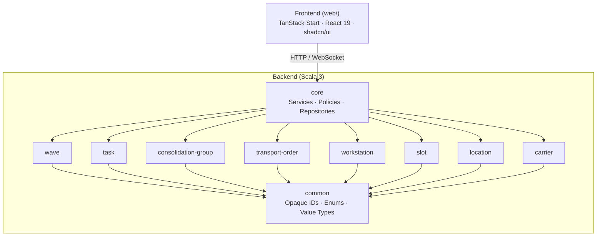
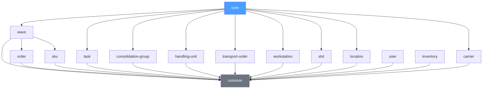
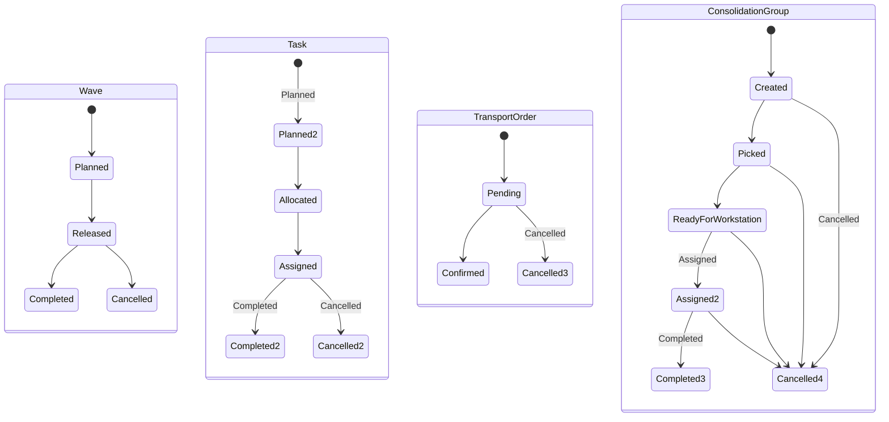
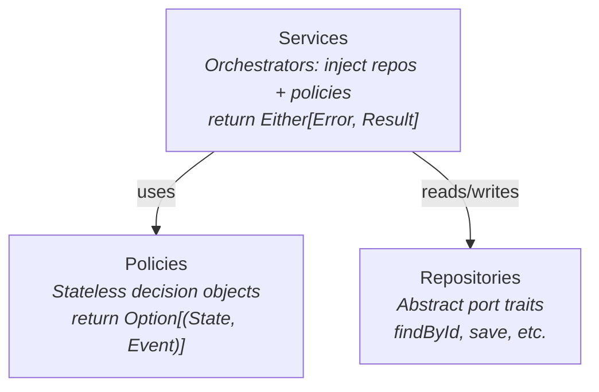
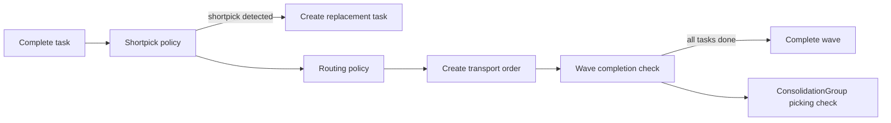

# Architecture

Neon WES is a Warehouse Execution System with a Scala 3 domain backend and a React/TanStack Start frontend.

## System Overview



## Backend Architecture

### Module Dependency Graph

Each top-level directory is an sbt subproject representing a domain aggregate:



All domain modules depend on `common`. Only `core` has cross-domain dependencies. Standalone modules (order, sku, user, inventory) have no cross-domain dependencies.

### Typestate-Encoded Aggregates

Domain aggregates encode their state machines at the type level. Each state is a distinct case class nested in the companion object. Transition methods exist only on valid source states and return `(NewState, Event)` tuples:

```scala
sealed trait Wave:
  def id: WaveId

object Wave:
  case class Planned(...) extends Wave:
    def release(...): (Released, WaveEvent.WaveReleased) = ...

  case class Released(...) extends Wave:
    def complete(...): (Completed, WaveEvent.WaveCompleted) = ...
    def cancel(...): (Cancelled, WaveEvent.WaveCancelled) = ...
```

The compiler prevents illegal transitions. You cannot call `complete` on a `Planned` wave because `Planned` doesn't expose that method.

**State machines:**



### Policy-Service-Repository Pattern (Core Module)

The core module orchestrates business logic through three layers:



**Policies** are pure business rules. They take the current state and return a decision. Easily testable in isolation.

**Services** are orchestrators. They wire together repositories and policies, manage cascading state transitions across aggregates, and return `Either[Error, Result]`.

**Repositories** are abstract trait ports. No concrete implementations exist in this codebase. Tests use in-memory mutable map implementations, and production implementations would be injected.

#### Cascading State Transitions

A single service call can trigger a multi-step cascade. For example, `TaskCompletionService.complete()`:



Each step is independently testable via its policy, while the service orchestrates the full cascade.

### Error Handling

Sealed trait ADTs for errors. Services return `Either[Error, Result]`. No exceptions for domain logic:

```scala
sealed trait TaskCompletionError
case class TaskNotFound(taskId: TaskId) extends TaskCompletionError
case class TaskNotAssigned(taskId: TaskId) extends TaskCompletionError
```

### Common Module

Provides the foundation shared by all modules:

- **Opaque type IDs**: UUID v7 (time-ordered) wrappers for type-safe entity references (`WaveId`, `TaskId`, etc.)
- **Shared enums**: `Priority` (Low, Normal, High, Critical), `PackagingLevel`, `TaskType`
- **Value types**: `UomHierarchy`, `Lot`

## Frontend Architecture

### Tech Stack

- **Framework**: TanStack Start (full-stack React framework on Vite + Nitro)
- **UI**: React 19, TypeScript 5.9
- **Components**: shadcn/ui (Base UI primitives + CVA variants + Tailwind CSS v4)
- **Styling**: Tailwind CSS v4 with OKLch color tokens, light/dark mode
- **Dev server**: Port 3000

### Directory Structure

```
web/src/
├── routes/            # File-based routing (TanStack Router)
├── components/ui/     # shadcn/ui components
├── lib/               # Utilities (cn() for class merging)
├── router.tsx         # Router configuration
├── routeTree.gen.ts   # Auto-generated route tree
└── styles.css         # Global styles + design tokens
```

### Path Alias

`@/*` maps to `src/*` in both TypeScript and Vite configs.
