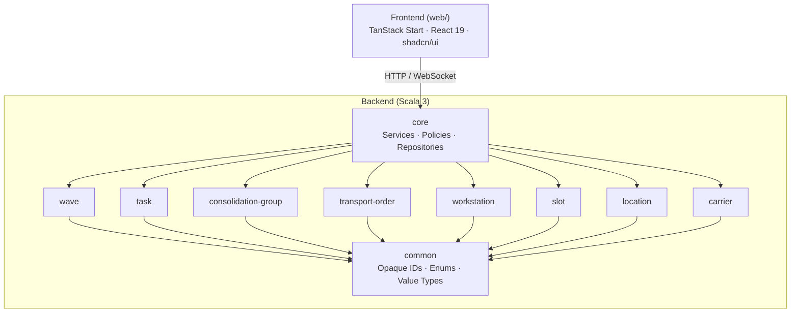
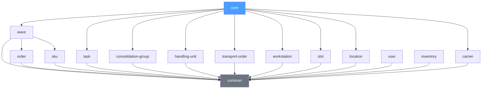
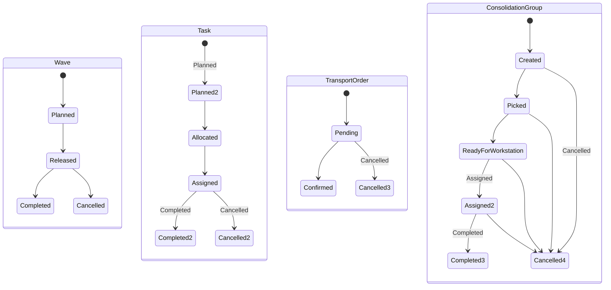
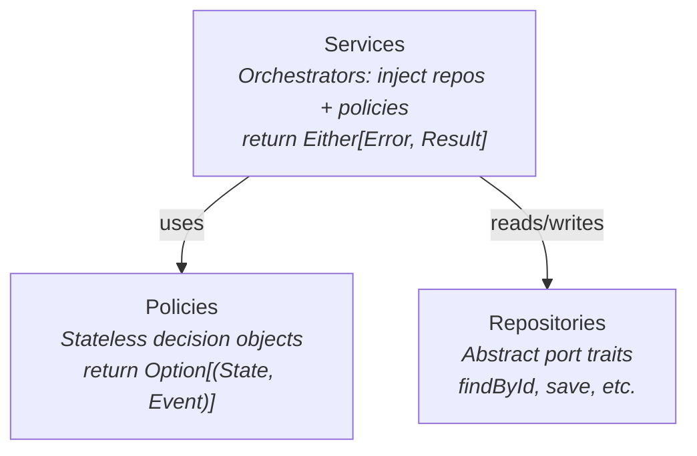
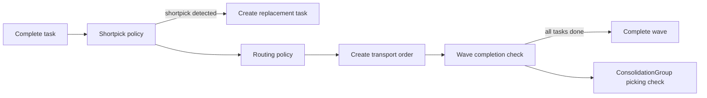

# Neon, Architecture Overview

**Status:** Living (kept in sync with the codebase).
**Last updated:** 2026-05-27
**Related:** ADRs at [`docs/decisions/`](decisions/README.md) · architecture book at [`docs/book/`](book/README.md) · agent guidance in [`CLAUDE.md`](../CLAUDE.md)

Neon WES is a Warehouse Execution System with a Scala 3 domain backend and a React/TanStack Start frontend. This is the short entry point: the [architecture book](book/README.md) covers every layer in depth, and the [ADRs](decisions/README.md) record *why* the architecture looks the way it does.

## System Overview



## Backend Architecture

### Module Dependency Graph

Each top-level directory is an sbt subproject representing a domain aggregate:



All domain modules depend on `common`. Only `core` has cross-domain dependencies. Standalone modules (order, sku, user, inventory) have no cross-domain dependencies.

### Typestate-Encoded Aggregates

Domain aggregates encode their state machines at the type level. Each state is a distinct case class nested in the companion object. Transition methods exist only on valid source states and return `(NewState, Event)` tuples:

```scala
sealed trait Wave:
  def id: WaveId

object Wave:
  case class Planned(...) extends Wave:
    def release(...): (Released, WaveEvent.WaveReleased) = ...

  case class Released(...) extends Wave:
    def complete(...): (Completed, WaveEvent.WaveCompleted) = ...
    def cancel(...): (Cancelled, WaveEvent.WaveCancelled) = ...
```

The compiler prevents illegal transitions. You cannot call `complete` on a `Planned` wave because `Planned` doesn't expose that method.

**State machines:**



### Policy-Service-Repository Pattern (Core Module)

The core module orchestrates business logic through three layers:



**Policies** are pure business rules. They take the current state and return a decision. Easily testable in isolation.

**Services** are orchestrators. They wire together repositories and policies, manage cascading state transitions across aggregates, and return `Either[Error, Result]`.

**Repositories** are abstract trait ports. No concrete implementations exist in this codebase. Tests use in-memory mutable map implementations, and production implementations would be injected.

#### Cascading State Transitions

A single service call can trigger a multi-step cascade. For example, `TaskCompletionService.complete()`:



Each step is independently testable via its policy, while the service orchestrates the full cascade.

### Error Handling

Sealed trait ADTs for errors. Services return `Either[Error, Result]`. No exceptions for domain logic:

```scala
sealed trait TaskCompletionError
case class TaskNotFound(taskId: TaskId) extends TaskCompletionError
case class TaskNotAssigned(taskId: TaskId) extends TaskCompletionError
```

### Common Module

Provides the foundation shared by all modules:

- **Opaque type IDs**: UUID v7 (time-ordered) wrappers for type-safe entity references (`WaveId`, `TaskId`, etc.)
- **Shared enums**: `Priority` (Low, Normal, High, Critical), `PackagingLevel`, `TaskType`
- **Value types**: `UomHierarchy`, `Lot`

## Frontend Architecture

### Tech Stack

- **Framework**: TanStack Start (full-stack React framework on Vite + Nitro)
- **UI**: React 19, TypeScript 5.9
- **Components**: shadcn/ui (Base UI primitives + CVA variants + Tailwind CSS v4)
- **Styling**: Tailwind CSS v4 with OKLch color tokens, light/dark mode
- **Dev server**: Port 3000

### Directory Structure

```
web/src/
├── routes/            # File-based routing (TanStack Router)
├── components/ui/     # shadcn/ui components
├── lib/               # Utilities (cn() for class merging)
├── router.tsx         # Router configuration
├── routeTree.gen.ts   # Auto-generated route tree
└── styles.css         # Global styles + design tokens
```

### Path Alias

`@/*` maps to `src/*` in both TypeScript and Vite configs.

## Key Invariants

The non-negotiable rules that shape the codebase. Brief restatement; each links to the ADR or chapter that establishes it.

1. **Typestate over runtime checks.** Aggregates model state machines as sealed traits with one case class per state; transition methods exist only on valid source states, so illegal transitions fail to compile. ([ADR-0001](decisions/0001-use-typestate-encoded-aggregates.md))
2. **Pure domain, effects at the edges.** Aggregates, events, and policies have no I/O, no clock, no randomness, no persistence. Side effects live in actors, Pekko repositories, and HTTP routes.
3. **Errors are values.** Domain and service operations return `Either[Error, Result]` (sync) or `Future`; sealed-trait error ADTs model business failure, never exceptions. ([ADR-0004](decisions/0004-use-either-based-error-handling.md))
4. **Policy decides, service orchestrates, repository persists.** Policies are pure and dependency-free; services inject policies and repositories; repositories are abstract ports with no concrete implementation in the domain. ([ADR-0002](decisions/0002-use-policy-service-repository-pattern.md))
5. **IDs are opaque UUID v7.** Every entity ID is an opaque type over a time-ordered UUID — compile-time-distinct, zero runtime overhead. ([ADR-0003](decisions/0003-use-opaque-type-ids-with-uuid-v7.md))
6. **One-way module dependencies.** `app → core → {domain modules} → common`. The sbt build enforces the graph; a module cannot import a sibling aggregate. ([ADR-0005](decisions/0005-use-domain-driven-sbt-modules.md))
7. **Immutable collections.** Prefer `List`; domain state is never mutated in place — new state is returned alongside the event that produced it.
8. **Polymorphic snapshots by name, not class.** Aggregate roots carry `@JsonTypeInfo(Id.NAME)` + `@JsonSubTypes`; `Id.CLASS` is avoided (refactor-fragile, deserialization-gadget risk) and Java serialization is disabled.

## Where to Find What

| Question | Source of truth |
|---|---|
| What is a WES, and what does Neon do? | [The book, Part I](book/01-the-domain/ch01-what-is-a-wes.md) |
| Why does the architecture look like this? | [ADR index](decisions/README.md) |
| How does X work in detail? | [The architecture book](book/README.md) |
| How do I add a new aggregate module? | [Chapter 20 — New aggregate](book/04-system-concerns/ch20-project-new-aggregate.md) |
| What are all the events / states / APIs? | [Appendices](book/06-appendices/) |
| What error format does the HTTP API use? | [ADR-0011](decisions/0011-use-rfc9457-problem-details-for-errors.md) |
| How do agents work on this codebase? | [`CLAUDE.md`](../CLAUDE.md) |
| What changed recently? | [`CHANGELOG.md`](../CHANGELOG.md) |
