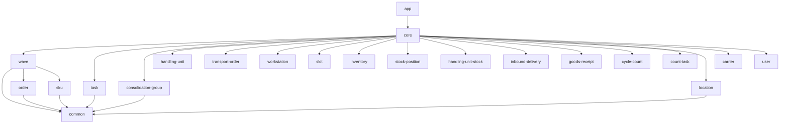

# Getting Started

Let's get the project running on your machine and take a first look at how it
is organized. By the end of this chapter we will have compiled every module, run
our first test, and built a mental map of where things live.

## Prerequisites

Before we begin, make sure you have the following installed:

- **JDK 21 or later.** Neon WES targets Scala 3.8.2, which runs on the JVM.
  Any distribution will do (Eclipse Temurin, Amazon Corretto, GraalBuild CE).
  Verify with `java -version`.

- **sbt (Scala Build Tool).** Version 1.x. This is the build tool that
  compiles, tests, and runs the project. Install it via your package manager
  or from [scala-sbt.org](https://www.scala-sbt.org/).

- **Docker.** Some integration tests in the `app` module use
  *Testcontainers* to spin up a PostgreSQL database automatically. You do not
  need Docker for the domain-level unit tests, but you will need it for the
  full test suite.

- **An editor with Scala support.** We recommend IntelliJ IDEA with the Scala
  plugin, or VS Code with Metals. Either will give you type-aware
  completions, inline errors, and go-to-definition across all 22 modules.

## Cloning and Building

Start by cloning the repository and compiling:

```bash
git clone <repository-url> neon-wes
cd neon-wes
sbt compile
```

The `sbt compile` command compiles all 22 modules in dependency order. On the
first run this will take a few minutes because sbt needs to download Scala
itself, Pekko, Circe, and every other library dependency. Subsequent
compilations are incremental and much faster.

If everything succeeds you will see:

```
[success] Total time: ...
```

Congratulations, the project builds. Let's look at what we just compiled.

## Project Structure at a Glance

Open the repository root in your file explorer or editor. The top-level
directories map one-to-one to sbt subprojects. Here they are, grouped by role:

```
neon-wes/
|
|-- common/                  <-- Foundation: shared types, IDs, enums
|
|-- order/                   \
|-- sku/                      |
|-- location/                 |-- Reference data (read-only, no actors)
|-- user/                     |
|-- carrier/                 /
|
|-- wave/                    \
|-- task/                     |
|-- consolidation-group/      |
|-- handling-unit/            |
|-- transport-order/          |
|-- workstation/              |  Event-sourced aggregates
|-- slot/                     |  (each with its own Pekko actor)
|-- inventory/                |
|-- stock-position/           |
|-- handling-unit-stock/      |
|-- inbound-delivery/         |
|-- goods-receipt/            |
|-- cycle-count/              |
|-- count-task/              /
|
|-- core/                    <-- Orchestration: policies, services
|
|-- app/                     <-- Application shell: HTTP, projections, bootstrap
```

That is a lot of directories, but the mental model is simple. There are four
layers, and dependencies flow in one direction: inward.

## The Dependency Graph

Let's make the layers explicit. Every module in Neon WES falls into one of four
tiers:

1. **Foundation.** The `common` module depends on nothing. It defines the
   shared vocabulary: opaque ID types, enums like `Priority` and
   `PackagingLevel`, and utility traits.

2. **Domain modules.** Both *reference data* modules and *event-sourced
   aggregate* modules sit in this tier. They depend on `common`, and some
   depend on each other when the domain requires it. For example, `wave`
   depends on `order` and `sku` because a wave is planned from customer
   orders and needs SKU information for UoM expansion.

3. **Orchestration.** The `core` module depends on every domain module. It
   contains the *policies* and *services* that coordinate work across
   aggregates. When a task completes, `core` decides whether to trigger a
   shortpick, route the next transport order, or complete the parent wave.
   All of that cross-aggregate logic lives here.

4. **Application shell.** The `app` module depends on `core` plus the
   reference data modules it needs for HTTP endpoints and CQRS projections.
   It wires everything together: Pekko cluster bootstrap, HTTP routes,
   projection handlers, and database migrations.

Here is a simplified view of the dependency graph:



The critical rule this structure enforces: **dependencies point inward.** A
domain module like `wave` can never import from `core` or `app`. The `core`
module can never import from `app`. This keeps domain logic free of
infrastructure concerns. If you accidentally add a forbidden dependency, sbt
will refuse to compile.

@:callout(info)

This layered dependency structure is an example of *Hexagonal
Architecture* (also called Ports and Adapters). Domain modules define port
interfaces; the `app` module provides the infrastructure adapters. We will
explore this pattern in detail in Chapter 8.

@:@

## Running Your First Test

Let's verify that the domain logic works. Run the `WaveSuite`, which tests the
Wave aggregate in isolation:

```bash
sbt "wave/testOnly neon.wave.WaveSuite"
```

This executes a single test suite. ScalaTest will print output like this:

```
WaveSuite:
Wave
  releasing
  - authorizes work to begin
  - carries order IDs for task creation
  - records when the wave was released
  completing
  - marks all work as done
  cancelling
  - can be cancelled before release
  - can be cancelled after release
  - cancellation event carries orderGrouping for downstream routing
  order grouping
  - is carried in events for downstream routing
```

Notice several things about this output. The suite uses `describe`/`it` blocks,
which produce the nested structure you see above. The test names read like
specifications ("authorizes work to begin," "marks all work as done"). And this
entire suite ran without a database, without an actor system, without Docker. It
exercises the `Wave` domain aggregate as a plain Scala object in memory.

The naming convention is straightforward: every test suite is named
`<ComponentName>Suite`. So `WaveSuite` tests the `Wave` aggregate,
`WavePlannerSuite` tests the `WavePlanner`, and `WaveActorSuite` tests the
Pekko actor that wraps the aggregate.

## Running a Module's Full Test Suite

To run every test in a single module, drop the `testOnly` qualifier:

```bash
sbt wave/test
```

This runs all five suites in the `wave` module: `WaveSuite`,
`WavePlannerSuite`, `UomExpansionSuite`, `WaveActorSuite`, and
`PekkoWaveRepositorySuite`. The first three are pure domain tests. The last
two exercise the Pekko actor layer and require an in-process actor system (but
still no external database).

You can do the same for any module:

```bash
sbt core/test          # All tests in the core module
sbt task/test          # All tests in the task module
```

To run the entire project's test suite:

```bash
sbt test
```

@:callout(info)

Some tests in the `app` module use Testcontainers to spin up a
PostgreSQL instance automatically. Make sure Docker is running before you
execute `sbt test` or `sbt app/test`. The domain-level tests in other
modules do not require Docker.

@:@

## Code Formatting and Linting

Neon WES enforces consistent formatting with two tools:

**Scalafmt** handles code formatting. The maximum line width is 100 characters.
To format all source files:

```bash
sbt scalafmtAll
```

To check formatting without modifying files (useful in CI):

```bash
sbt scalafmtCheckAll
```

**Scalafix** handles import organization. It uses the `OrganizeImports` rule
with `Merge` grouping, which means imports from the same package are combined
into a single import statement. To run it:

```bash
sbt scalafixAll
```

If you are using IntelliJ or Metals, both can be configured to run Scalafmt on
save. We recommend enabling this so formatting never drifts.

## The Vertical Slice Convention

Now that we can build and test, let's look more closely at how a single module
is organized. Each event-sourced aggregate follows the same *vertical slice*
pattern. Let's use `wave/` as our example:

```
wave/
  src/main/scala/neon/wave/
    Wave.scala                  # Domain aggregate (typestate encoding)
    WaveEvent.scala             # Domain events (sealed trait)
    WaveActor.scala             # Pekko EventSourcedBehavior
    WaveRepository.scala        # Sync repository port (trait)
    AsyncWaveRepository.scala   # Async repository port (trait)
    PekkoWaveRepository.scala   # Cluster sharding adapter (implementation)
    WavePlanner.scala           # Wave planning logic
    OrderGrouping.scala         # Supporting domain type
    TaskRequest.scala           # Supporting domain type
    UomExpansion.scala          # Unit-of-measure expansion logic
```

The first six files follow a pattern that repeats across every event-sourced
module. Let's briefly describe each one:

- **`Wave.scala`** contains the domain aggregate itself, modeled as a sealed
  trait hierarchy with *typestate encoding*. Each state (Planned, Released,
  Completed, Cancelled) is a separate case class with transition methods that
  only exist on valid source states.

- **`WaveEvent.scala`** defines the events that the aggregate produces. Every
  state transition returns a `(NewState, Event)` tuple, so the event type
  mirrors the transitions in the aggregate.

- **`WaveActor.scala`** wraps the domain aggregate in a Pekko
  `EventSourcedBehavior`. It translates external commands into aggregate
  method calls, persists the resulting events, and reconstructs state during
  recovery.

- **`WaveRepository.scala`** defines the synchronous repository port. This is
  a simple trait with methods like `findById` and `save`. Tests use in-memory
  implementations of this trait.

- **`AsyncWaveRepository.scala`** defines the asynchronous repository port,
  returning `Future`s. This is the port that services in `core` call at
  runtime.

- **`PekkoWaveRepository.scala`** implements the async port using Pekko
  Cluster Sharding. It sends commands to sharded entity actors and translates
  the replies back into domain types.

The remaining files (`WavePlanner.scala`, `OrderGrouping.scala`,
`TaskRequest.scala`, `UomExpansion.scala`) are domain-specific helpers that
vary from module to module. The six-file core pattern, however, is consistent.

This vertical slice design means that when you work on a feature for a
particular aggregate, everything you need lives in one directory. You rarely
need to jump between modules for day-to-day aggregate work. The only exception
is `core/`, where cross-aggregate orchestration happens.

We will explore each of these file types in depth over the next several
chapters.

## A Note on Directory and Package Naming

You may have noticed that directory names use *kebab-case*
(`consolidation-group/`, `handling-unit/`, `transport-order/`), while Scala
package names use concatenated names (`neon.consolidationgroup`,
`neon.handlingunit`, `neon.transportorder`). This is a deliberate convention.
Kebab-case is idiomatic for directory names in multi-module projects, but JVM
package names cannot contain hyphens.

The mapping is predictable: strip the hyphens and concatenate. If you see a
directory called `count-task/`, the package inside is `neon.counttask`.

## What is Next?

We now have a working build, we know how to run tests at every level of
granularity, and we have a map of the project's 22 modules and four
architectural layers. That is enough to start reading code.

In Part II, we will dive into the code itself. We will start with the `common`
module, the foundation that every other module depends on. There we will meet
the opaque ID types, shared enums, and utility traits that form the vocabulary
of the entire system.
