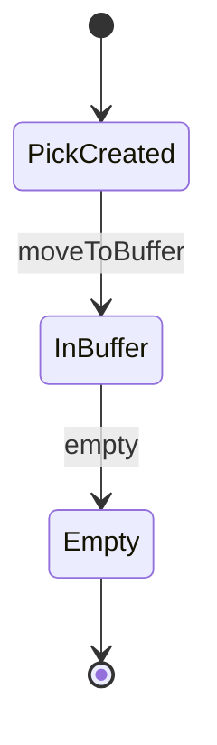
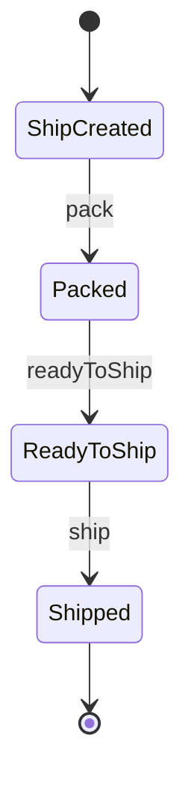
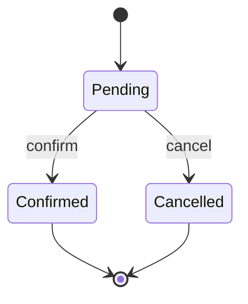
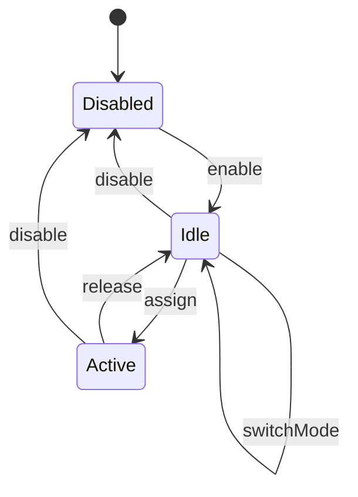
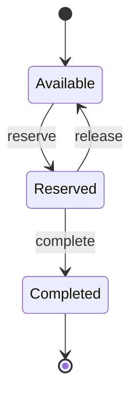

# Handling Units and Workstations

So far we have dealt mostly with quantities: how many units to allocate, how
many to pick, how many to count. But a warehouse is not a spreadsheet. Physical
objects move through physical space. Totes travel on conveyors. Cartons sit in
put-wall slots. Pack stations switch between picking mode and counting mode as
the day progresses.

In this chapter, we will explore the aggregates that model physical movement:
`HandlingUnit` for containers, `TransportOrder` for routing, `Workstation` for
processing stations, and `Slot` for put-wall positions. Together, these four
aggregates form the execution layer that turns planned work into physical
fulfillment.


## Handling Unit: Two Streams in One Aggregate

A handling unit is a physical container that moves through the warehouse. It
might be a pick tote (a reusable bin that pickers fill with items) or a ship
container (a carton or pallet that leaves the building). These two roles have
fundamentally different lifecycles, so Neon WES models them as two independent
streams within a single sealed trait.

```scala
sealed trait HandlingUnit:
  def id: HandlingUnitId
  def packagingLevel: PackagingLevel
```

<small>*File: handling-unit/src/main/scala/neon/handlingunit/HandlingUnit.scala*</small>

The role is encoded in the *type*, not in a runtime field. There is no `role`
enum or `isPick` boolean. A `PickCreated` is a pick tote by virtue of being a
`PickCreated`. A `ShipCreated` is a ship container by virtue of being a
`ShipCreated`. The compiler enforces this distinction at every step.

### The Pick Stream

Pick totes are reusable warehouse assets. A tote gets created, travels with a
picker to collect items, arrives at a consolidation buffer, gets emptied during
deconsolidation, and returns to the pool for the next wave.



```scala
case class PickCreated(
    id: HandlingUnitId,
    packagingLevel: PackagingLevel,
    currentLocation: LocationId
) extends HandlingUnit:

  def moveToBuffer(
      locationId: LocationId,
      at: Instant
  ): (InBuffer, HandlingUnitEvent.HandlingUnitMovedToBuffer) =
    val inBuffer = InBuffer(id, packagingLevel, locationId)
    val event = HandlingUnitEvent.HandlingUnitMovedToBuffer(id, locationId, at)
    (inBuffer, event)
```

<small>*File: handling-unit/src/main/scala/neon/handlingunit/HandlingUnit.scala*</small>

When the tote arrives at the consolidation area, `moveToBuffer` transitions it
to `InBuffer` with the buffer location. After a workstation operator empties the
tote (moving its contents into order-specific ship containers), `empty`
transitions it to the terminal `Empty` state.

### The Ship Stream

Ship containers leave the building. A carton or pallet is created for a
specific order, gets packed at a workstation, is marked ready for shipping, and
finally ships out.



```scala
case class ShipCreated(
    id: HandlingUnitId,
    packagingLevel: PackagingLevel,
    currentLocation: LocationId,
    orderId: OrderId
) extends HandlingUnit:

  def pack(at: Instant): (Packed, HandlingUnitEvent.HandlingUnitPacked) =
    val packed = Packed(id, packagingLevel, currentLocation, orderId)
    val event = HandlingUnitEvent.HandlingUnitPacked(id, orderId, at)
    (packed, event)
```

<small>*File: handling-unit/src/main/scala/neon/handlingunit/HandlingUnit.scala*</small>

Notice the `orderId` field. Ship containers are bound to a specific order from
creation. Pick totes are not; they collect items for potentially many orders
and get sorted at the workstation. This is the fundamental difference between
the two streams.

The ship stream has more states because the outbound process has more
checkpoints:

1. **ShipCreated**: the container exists and is assigned to an order.
2. **Packed**: items have been placed in the container at a workstation.
3. **ReadyToShip**: the container has been labeled, weighed, and staged for
   pickup.
4. **Shipped**: the container has left the building. Terminal state.

### Why Two Streams?

One might ask: why not a single linear state machine with a `role` field? The
answer is that the two streams have different shapes, different data, and
different lifetimes.

| Aspect            | Pick Stream                    | Ship Stream                       |
| ----------------- | ------------------------------ | --------------------------------- |
| **Lifecycle**     | Created, InBuffer, Empty       | Created, Packed, ReadyToShip, Shipped |
| **Order binding** | None (multi-order collection)  | Bound to one order from creation  |
| **Terminal state** | Empty (tote returns to pool)  | Shipped (container leaves forever) |
| **Reusability**   | Tote is reused after emptying  | Container is a one-way trip       |

A unified state machine would need conditional transitions ("if pick, then
moveToBuffer; if ship, then pack"), runtime type checks, and a nullable orderId
that is always null for pick totes. The dual-stream approach eliminates all of
that. Each stream has exactly the transitions it needs, and the compiler
prevents calling `pack` on a pick tote or `moveToBuffer` on a ship container.

@:callout(info)

Both streams share the same `HandlingUnitId` type and the same
`packagingLevel` field. The sealed trait provides these common fields while
the case classes add stream-specific data like `orderId` for ship containers
and `currentLocation` for pick totes.

@:@


## Transport Orders: Bridging the Gap

When a task completes, the handling unit needs to move to its next destination.
A pick tote needs to go to a consolidation buffer. A replenishment pallet needs
to go to a forward pick location. This movement is represented by a
`TransportOrder`.



The transport order lifecycle is intentionally simple:

```scala
sealed trait TransportOrder:
  def id: TransportOrderId
  def handlingUnitId: HandlingUnitId
  def destination: LocationId

object TransportOrder:
  def create(
      handlingUnitId: HandlingUnitId,
      destination: LocationId,
      at: Instant
  ): (Pending, TransportOrderEvent.TransportOrderCreated) =
    val id = TransportOrderId()
    val pending = Pending(id, handlingUnitId, destination)
    val event = TransportOrderEvent.TransportOrderCreated(
      id, handlingUnitId, destination, at
    )
    (pending, event)
```

<small>*File: transport-order/src/main/scala/neon/transportorder/TransportOrder.scala*</small>

A transport order is `Pending` until an operator confirms delivery at the
destination. It can also be `Cancelled` if the movement is no longer needed
(for example, if the task that created it was cancelled).

### Connection to the Routing Policy

Transport orders are created by the `RoutingPolicy`, which runs as part of
the task completion cascade in `TaskCompletionService`:

```scala
object RoutingPolicy:

  def apply(
      event: TaskEvent.TaskCompleted,
      at: Instant
  ): Option[(TransportOrder.Pending, TransportOrderEvent.TransportOrderCreated)] =
    event.handlingUnitId.map { handlingUnitId =>
      TransportOrder.create(handlingUnitId, event.destinationLocationId, at)
    }
```

<small>*File: core/src/main/scala/neon/core/RoutingPolicy.scala*</small>

The policy returns `None` when the completed task has no handling unit
(some task types, like replenishment or transfer, may operate without one).
When a handling unit is present, the policy creates a `Pending` transport order
targeting the task's destination location.

This represents the temporal gap between task completion and physical arrival.
The picker scans the last item, the task completes, and a transport order is
born. The tote then travels (by conveyor, by cart, by hand) to the destination.
When it arrives and the operator scans it, the transport order is confirmed.

@:callout(info)

Transport orders are deliberately decoupled from the task that
created them. The task is already `Completed` when the transport order is
`Pending`. This separation means that a delayed delivery does not block
task completion, and a cancelled transport order does not retroactively
affect the task.

@:@


## Workstation Lifecycle

A workstation is a physical station where consolidation and packing operations
occur. Neon WES supports two types:

```scala
enum WorkstationType:
  case PutWall
  case PackStation
```

<small>*File: workstation/src/main/scala/neon/workstation/WorkstationType.scala*</small>

- **PutWall**: a wall of slots (cubbies) where pick totes are deconsolidated
  into order-specific containers. Items from a multi-order tote get sorted into
  individual order slots.
- **PackStation**: a packing bench where items are packed into ship containers,
  labeled, and staged for outbound.

The workstation lifecycle is cyclical. Unlike most aggregates we have seen, a
workstation does not progress toward a terminal state. It cycles between idle
and active as work flows through it:



### Disabled

Every workstation starts disabled. This represents a station that is powered
off, under maintenance, or otherwise unavailable:

```scala
case class Disabled(
    id: WorkstationId,
    workstationType: WorkstationType,
    slotCount: Int
) extends Workstation:

  def enable(at: Instant): (Idle, WorkstationEvent.WorkstationEnabled) =
    val mode = WorkstationMode.Picking
    val idle = Idle(id, workstationType, slotCount, mode)
    ...
```

<small>*File: workstation/src/main/scala/neon/workstation/Workstation.scala*</small>

When enabled, the workstation transitions to `Idle` with a default mode of
`Picking`. The `slotCount` field records how many physical slots (cubbies, bin
positions) the workstation has. For a put-wall, this determines how many orders
can be processed simultaneously.

### Idle and Mode Switching

An idle workstation is enabled and waiting for work. This is where mode
switching happens:

```scala
case class Idle(
    id: WorkstationId,
    workstationType: WorkstationType,
    slotCount: Int,
    mode: WorkstationMode
) extends Workstation:

  def switchMode(
      newMode: WorkstationMode,
      at: Instant
  ): (Idle, WorkstationEvent.ModeSwitched) =
    val switched = copy(mode = newMode)
    val event = WorkstationEvent.ModeSwitched(
      id, workstationType, mode, newMode, at
    )
    (switched, event)
```

<small>*File: workstation/src/main/scala/neon/workstation/Workstation.scala*</small>

The `WorkstationMode` enum defines three operational modes:

```scala
enum WorkstationMode:
  case Receiving   // Inbound goods receipt processing
  case Picking     // Outbound order picking
  case Counting    // Cycle count and physical inventory operations
```

<small>*File: common/src/main/scala/neon/common/WorkstationMode.scala*</small>

Mode switching is only allowed in the `Idle` state. You cannot change a
workstation's mode while it is actively processing a consolidation group. This
constraint prevents the confusion that would arise from switching a station
from picking to counting while orders are half-sorted in its slots.

### Active

When work is assigned, the workstation transitions to `Active` with an
`assignmentId` that identifies the consolidation group or work batch:

```scala
case class Active(
    id: WorkstationId,
    workstationType: WorkstationType,
    slotCount: Int,
    mode: WorkstationMode,
    assignmentId: UUID
) extends Workstation:

  def release(at: Instant): (Idle, WorkstationEvent.WorkstationReleased) =
    val idle = Idle(id, workstationType, slotCount, mode)
    ...
```

<small>*File: workstation/src/main/scala/neon/workstation/Workstation.scala*</small>

One consolidation group at a time. When the work is finished, `release`
transitions back to `Idle`, and the workstation is ready for the next
assignment. The cyclical nature (`Idle` to `Active` and back) is what
distinguishes workstations from most other aggregates in the system.

### Disabling from Any Active State

Both `Idle` and `Active` support `disable`, which transitions directly to
`Disabled`. This handles the real-world scenario where a workstation needs to
be taken offline urgently (equipment failure, safety issue) regardless of
whether it is currently processing work.

@:callout(info)

Disabling an `Active` workstation does not automatically cancel
the assigned work. The consolidation group must be handled separately.
The workstation aggregate only manages the station's own lifecycle; it does
not cascade into work assignment logic.

@:@


## Slot Lifecycle

A slot is a physical position within a put-wall workstation. Each slot holds one
order at a time, with a ship handling unit waiting to receive the sorted items.



```scala
sealed trait Slot:
  def id: SlotId
  def workstationId: WorkstationId
```

<small>*File: slot/src/main/scala/neon/slot/Slot.scala*</small>

### Available

An available slot is empty and ready for an order. When the system assigns an
order to this slot, it transitions to `Reserved`:

```scala
case class Available(
    id: SlotId,
    workstationId: WorkstationId
) extends Slot:

  def reserve(
      orderId: OrderId,
      handlingUnitId: HandlingUnitId,
      at: Instant
  ): (Reserved, SlotEvent.SlotReserved) =
    val reserved = Reserved(id, workstationId, orderId, handlingUnitId)
    val event = SlotEvent.SlotReserved(
      id, workstationId, orderId, handlingUnitId, at
    )
    (reserved, event)
```

<small>*File: slot/src/main/scala/neon/slot/Slot.scala*</small>

The reservation binds three things together: the physical slot, the customer
order, and the ship handling unit. This triad is what enables the put-wall
operator to sort items correctly: "scan item, system says put in slot 7, slot 7
is order #4472, order #4472's carton is HU-89012."

### Reserved

A reserved slot holds an order and its associated ship handling unit. Two exits
are possible:

```scala
case class Reserved(
    id: SlotId,
    workstationId: WorkstationId,
    orderId: OrderId,
    handlingUnitId: HandlingUnitId
) extends Slot:

  def complete(at: Instant): (Completed, SlotEvent.SlotCompleted) = ...

  def release(at: Instant): (Available, SlotEvent.SlotReleased) =
    val available = Available(id, workstationId)
    val event = SlotEvent.SlotReleased(id, workstationId, orderId, at)
    (available, event)
```

<small>*File: slot/src/main/scala/neon/slot/Slot.scala*</small>

- **`complete`** moves the slot to the terminal `Completed` state. All items
  for the order have been placed in the ship container.
- **`release`** returns the slot to `Available`, dissolving the order binding.
  This is used for pre-placement cancellation: the order was assigned to the
  slot but no items have been placed yet, so the system can safely release it
  for another order.

### Completed

A completed slot has fulfilled its purpose. The order has been processed, and
the ship handling unit is ready for the next step (packing, labeling, staging).
This is a terminal state.

@:callout(info)

Slot completion does not automatically advance the ship handling
unit to its next state. The handling unit aggregate manages its own
lifecycle. The slot simply records that its order has been fully processed
at this workstation position.

@:@


## How the Pieces Connect

Let's trace a complete physical flow to see how these four aggregates work
together during outbound fulfillment:

1. **Wave release** creates pick tasks. Each task is associated with a pick
   handling unit (`PickCreated`).

2. **Picking** happens. The picker fills the tote with items from multiple
   orders.

3. **Task completion** triggers the `RoutingPolicy`, which creates a
   `TransportOrder.Pending` to route the pick tote to a consolidation buffer.

4. **Transport confirmation** happens when the tote arrives at the buffer. The
   transport order transitions to `Confirmed`, and the handling unit transitions
   to `InBuffer`.

5. **Workstation assignment** allocates a put-wall workstation. Orders from
   the consolidation group are assigned to slots, each slot getting a
   `ShipCreated` handling unit for its order.

6. **Deconsolidation** happens. The operator scans items from the pick tote
   and places them into the correct slots. As each slot's order is fulfilled,
   the slot transitions to `Completed` and the ship handling unit transitions
   to `Packed`.

7. **Pick tote emptied.** When all items have been sorted, the pick handling
   unit transitions to `Empty` and returns to the tote pool.

8. **Packing and shipping.** The ship containers move to a pack station (or
   skip it if pre-packed). They transition through `ReadyToShip` and finally
   `Shipped` as they leave the building.

Through this flow, the four aggregates maintain clear boundaries. Handling units
track the containers. Transport orders track the movements. Workstations track
the processing stations. Slots track the positions within those stations. Each
aggregate owns its own state machine, and cross-aggregate coordination happens
through the services and policies in the core module.

In the next chapter, we will look at how the event-sourced infrastructure
supports all of these aggregates at scale, with projections that build the
read-side views needed for real-time warehouse dashboards and operator screens.
