# Appendix A: State Machine Diagrams

Every domain aggregate in Neon WES is listed below with its state machine. Aggregates that use the typestate pattern encode states as case classes inside a sealed trait hierarchy; transition methods exist only on valid source states.

---

## Wave

A wave groups orders for batch processing through the warehouse. Planned waves are released to trigger task creation, then complete when all tasks finish.

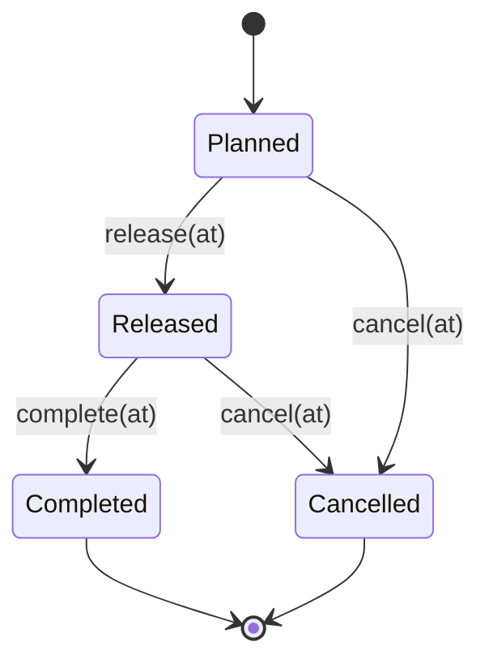

---

## Task

A task represents a single atomic warehouse operation (pick, putaway, replenish, or transfer) for one SKU. Shortpick handling occurs at the Assigned-to-Completed transition when `actualQuantity < requestedQuantity`.

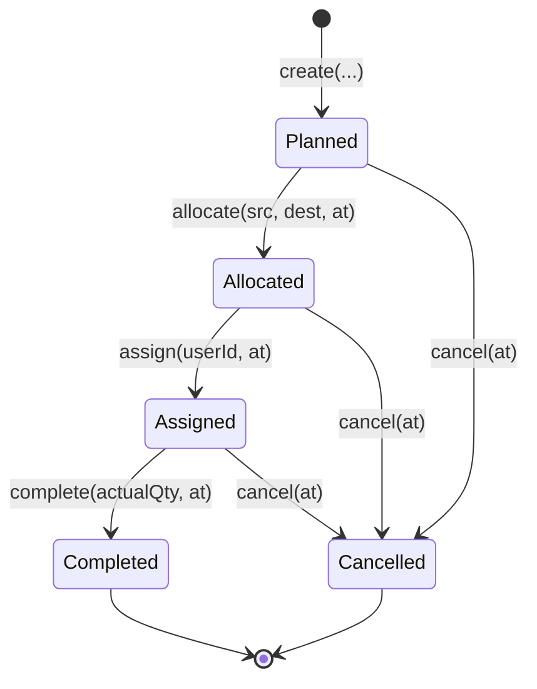

---

## ConsolidationGroup

A consolidation group batches orders from a wave for workstation processing. It progresses through picking, buffer arrival, workstation assignment, and completion.

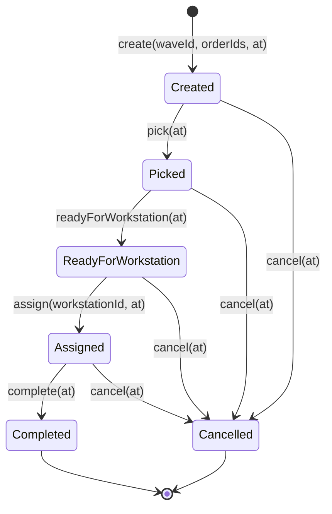

---

## HandlingUnit

A handling unit is a physical container that moves through the warehouse. Two independent lifecycle streams share the same sealed trait.

### Pick Stream

Pick handling units transport picked items from storage to a consolidation buffer, then are emptied after deconsolidation.

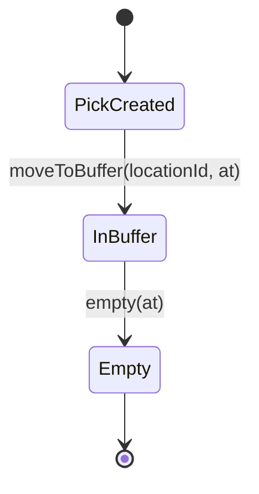

### Ship Stream

Ship handling units carry packed orders from workstations through outbound shipping.

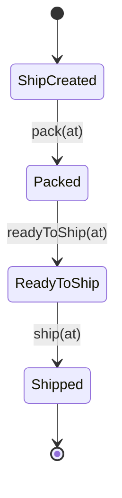

---

## TransportOrder

A transport order routes a handling unit to a destination. It represents the temporal gap between task completion and operator confirmation at the destination.

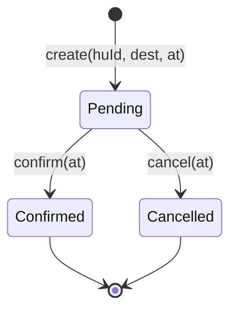

---

## Workstation

A workstation is a physical station (put-wall or pack station) where consolidation and packing operations occur. It cycles between Idle and Active and can be disabled from either state.

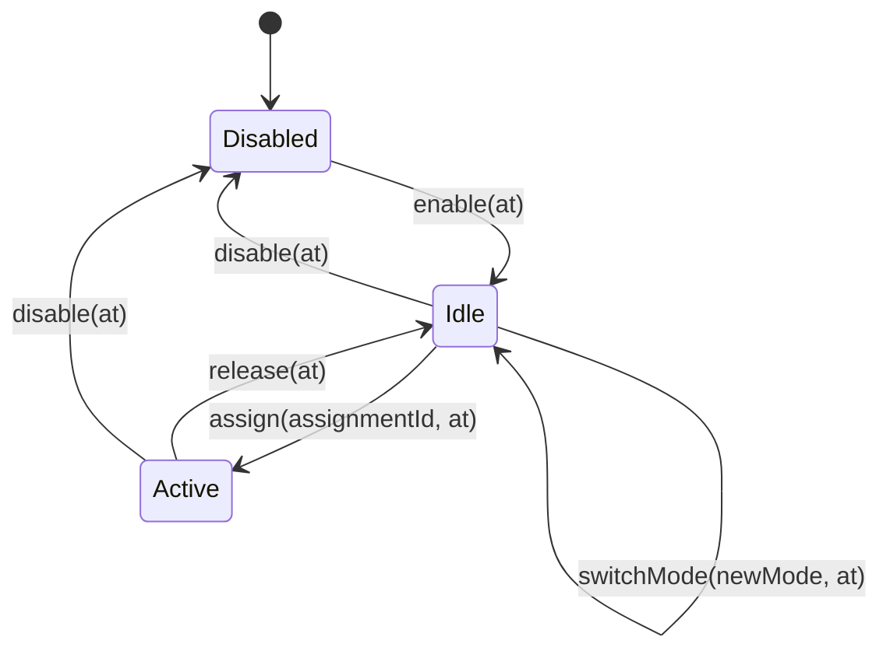

---

## Slot

A slot is a put-wall position within a workstation. Each slot is bound to one order at a time.

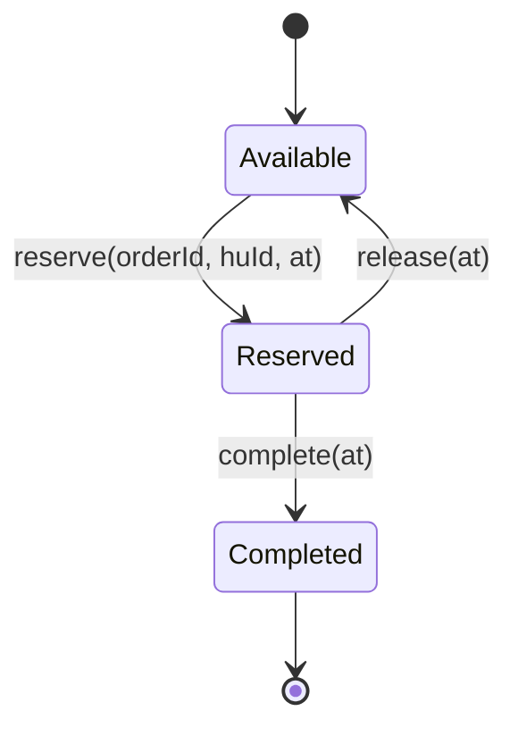

---

## InboundDelivery

An inbound delivery represents an expected receipt of goods into the warehouse. It tracks expected, received, and rejected quantities through the receiving process.

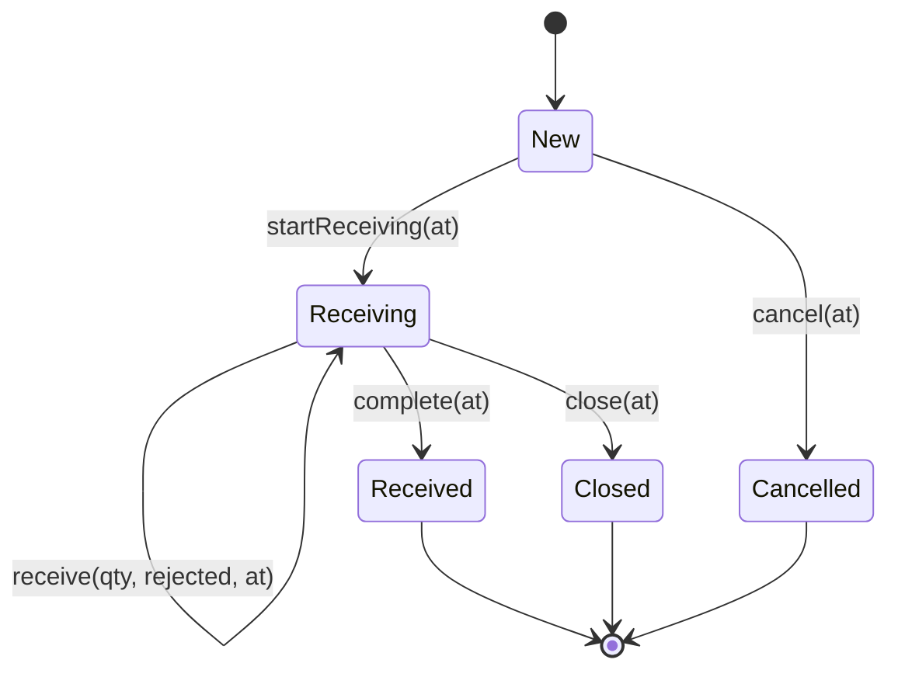

---

## GoodsReceipt

A goods receipt represents a physical receiving session against an inbound delivery. Lines are recorded incrementally before confirmation.

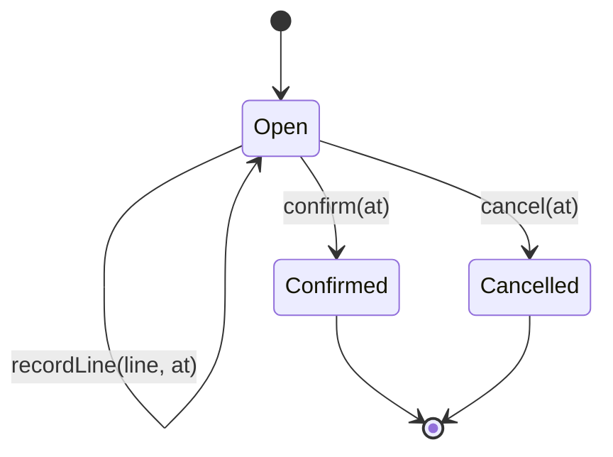

---

## CycleCount

A cycle count represents a scheduled or ad-hoc inventory verification for a set of SKUs within a warehouse area. It groups individual count tasks.

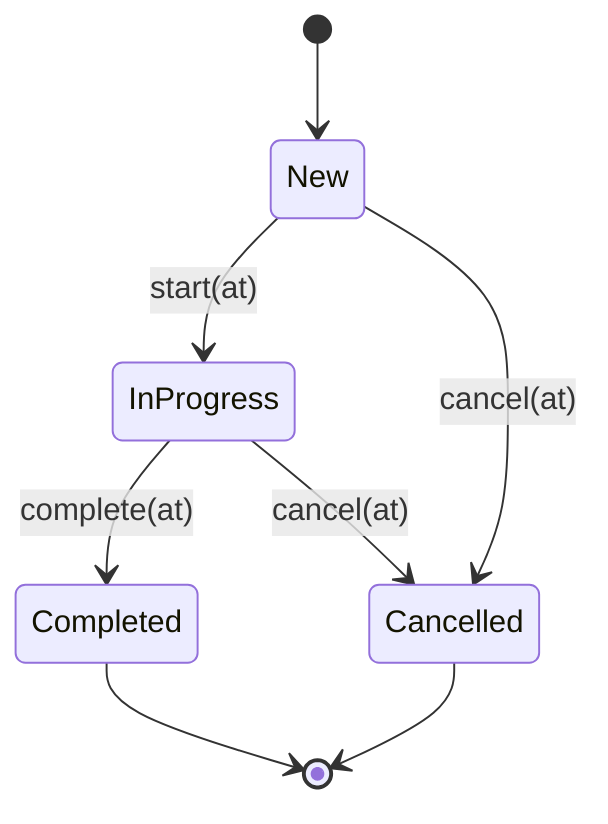

---

## CountTask

A count task represents a single SKU-location count within a cycle count. The counter records the actual quantity; variance is computed automatically.

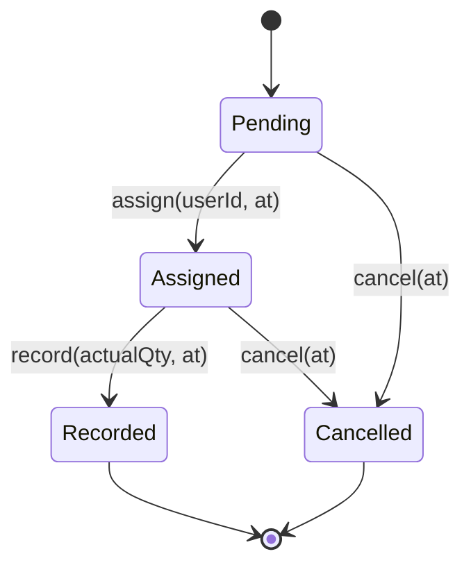

---

## StockPosition (4-Bucket Model)

A stock position is an area-level inventory position keyed by (SKU, warehouse area, lot attributes). It does not follow a state machine; instead, it maintains a 4-bucket quantity model with an enforced invariant.

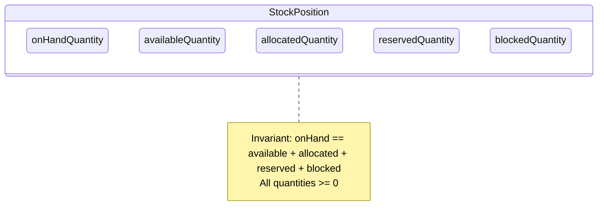

**Bucket transitions:**

| Operation            | From                   | To                 | Trigger                             |
| -------------------- | ---------------------- | ------------------ | ----------------------------------- |
| `allocate`           | available              | allocated          | Outbound order allocation           |
| `deallocate`         | allocated              | available          | Task cancellation                   |
| `consumeAllocated`   | allocated (and onHand) | removed            | Task completion                     |
| `addQuantity`        | (external)             | onHand + available | Inbound receiving                   |
| `reserve`            | available              | reserved           | Internal ops (counting, relocation) |
| `releaseReservation` | reserved               | available          | Internal ops complete               |
| `block`              | available              | blocked            | Administrative hold                 |
| `unblock`            | blocked                | available          | Hold released                       |
| `adjust`             | onHand + available     | adjusted           | SOX-compliant correction            |

---

## HandlingUnitStock (4-Bucket Model)

A handling unit stock is a container-level inventory position keyed by (container, slot, stock position). It mirrors the StockPosition 4-bucket model at the physical container level.

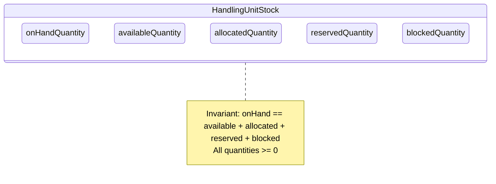

The operations are identical to StockPosition: `allocate`, `deallocate`, `addQuantity`, `consumeAllocated`, `reserve`, `releaseReservation`, `block`, `unblock`, `adjust`, and `changeStatus`.

---

## Inventory (2-Bucket Model)

An inventory position is identified by the (location, SKU, lot) triad and tracks on-hand and reserved quantities. Available is a computed value, not a stored bucket.

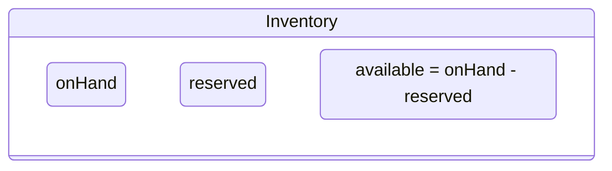

| Operation    | Effect                         | Trigger                                 |
| ------------ | ------------------------------ | --------------------------------------- |
| `reserve`    | reserved += qty                | Outbound allocation                     |
| `release`    | reserved -= qty                | Task cancellation                       |
| `consume`    | onHand -= qty, reserved -= qty | Task completion                         |
| `correctLot` | lot updated                    | Lot correction (requires reserved == 0) |
