# Appendix B: Module Dependency Graph

## Dependency Diagram

```mermaid
graph TD
    app["app<br/><small>neon-app</small>"]
    core["core<br/><small>neon-core</small>"]
    wave["wave<br/><small>neon-wave</small>"]
    task["task<br/><small>neon-task</small>"]
    cg["consolidation-group<br/><small>neon-consolidation-group</small>"]
    hu["handling-unit<br/><small>neon-handling-unit</small>"]
    to["transport-order<br/><small>neon-transport-order</small>"]
    ws["workstation<br/><small>neon-workstation</small>"]
    slot["slot<br/><small>neon-slot</small>"]
    inv["inventory<br/><small>neon-inventory</small>"]
    sp["stock-position<br/><small>neon-stock-position</small>"]
    hus["handling-unit-stock<br/><small>neon-handling-unit-stock</small>"]
    ibd["inbound-delivery<br/><small>neon-inbound-delivery</small>"]
    gr["goods-receipt<br/><small>neon-goods-receipt</small>"]
    cc["cycle-count<br/><small>neon-cycle-count</small>"]
    ct["count-task<br/><small>neon-count-task</small>"]
    common["common<br/><small>neon-common</small>"]
    order["order<br/><small>neon-order</small>"]
    location["location<br/><small>neon-location</small>"]
    sku["sku<br/><small>neon-sku</small>"]
    user["user<br/><small>neon-user</small>"]
    carrier["carrier<br/><small>neon-carrier</small>"]

    app --> core
    app --> inv
    app --> order
    app --> sku
    app --> user

    core --> common
    core --> wave
    core --> task
    core --> cg
    core --> hu
    core --> to
    core --> ws
    core --> slot
    core --> inv
    core --> sp
    core --> hus
    core --> ibd
    core --> gr
    core --> cc
    core --> ct
    core --> location
    core --> carrier
    core --> user

    wave --> common
    wave --> order
    wave --> sku
    task --> common
    cg --> common
    hu --> common
    to --> common
    ws --> common
    slot --> common
    inv --> common
    sp --> common
    hus --> common
    ibd --> common
    gr --> common
    cc --> common
    ct --> common

    order --> common
    location --> common
    sku --> common
    user --> common
    carrier --> common
```

## Module Reference

### Reference Data Modules (no Pekko actors)

| Module     | sbt Name        | Package         | Direct Dependencies |
| ---------- | --------------- | --------------- | ------------------- |
| `common`   | `neon-common`   | `neon.common`   | (none)              |
| `order`    | `neon-order`    | `neon.order`    | common              |
| `location` | `neon-location` | `neon.location` | common              |
| `sku`      | `neon-sku`      | `neon.sku`      | common              |
| `user`     | `neon-user`     | `neon.user`     | common              |
| `carrier`  | `neon-carrier`  | `neon.carrier`  | common              |

### Event-Sourced Aggregate Modules (with Pekko actors)

| Module                | sbt Name                   | Package                   | Direct Dependencies |
| --------------------- | -------------------------- | ------------------------- | ------------------- |
| `wave`                | `neon-wave`                | `neon.wave`               | common, order, sku  |
| `task`                | `neon-task`                | `neon.task`               | common              |
| `consolidation-group` | `neon-consolidation-group` | `neon.consolidationgroup` | common              |
| `handling-unit`       | `neon-handling-unit`       | `neon.handlingunit`       | common              |
| `transport-order`     | `neon-transport-order`     | `neon.transportorder`     | common              |
| `workstation`         | `neon-workstation`         | `neon.workstation`        | common              |
| `slot`                | `neon-slot`                | `neon.slot`               | common              |
| `inventory`           | `neon-inventory`           | `neon.inventory`          | common              |
| `stock-position`      | `neon-stock-position`      | `neon.stockposition`      | common              |
| `handling-unit-stock` | `neon-handling-unit-stock` | `neon.handlingunitstock`  | common              |
| `inbound-delivery`    | `neon-inbound-delivery`    | `neon.inbounddelivery`    | common              |
| `goods-receipt`       | `neon-goods-receipt`       | `neon.goodsreceipt`       | common              |
| `cycle-count`         | `neon-cycle-count`         | `neon.cyclecount`         | common              |
| `count-task`          | `neon-count-task`          | `neon.counttask`          | common              |

### Orchestration and Application Modules

| Module | sbt Name    | Package     | Direct Dependencies                                           |
| ------ | ----------- | ----------- | ------------------------------------------------------------- |
| `core` | `neon-core` | `neon.core` | common, all 14 event-sourced modules, location, carrier, user |
| `app`  | `neon-app`  | `neon.app`  | core, inventory, order, sku, user                             |

### Naming Convention

Directory names use **kebab-case** (e.g., `consolidation-group`), while package names use **concatenated lowercase** (e.g., `neon.consolidationgroup`). The sbt project name always uses the `neon-` prefix with the directory name (e.g., `neon-consolidation-group`).
