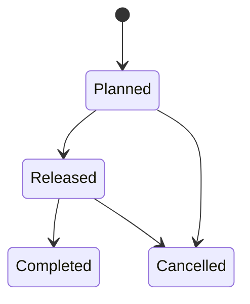

# Foreword

Warehouses are fascinating places. Every day, thousands of orders flow in, each
one triggering a cascade of decisions: which items to pick, from which locations,
in what sequence, and how to group them for efficient movement through the
building. The software that orchestrates all of this is called a *Warehouse
Execution System*, or WES for short.

Neon WES is one such system. It is built in Scala 3, powered by event sourcing
and the actor model, and structured around the principles of domain-driven
design. This book will walk you through every layer of its architecture, from
the domain aggregates at the center to the HTTP API at the edge.

## Who This Book Is For

**Developers learning event sourcing and DDD.** If you have read about event
sourcing, CQRS, or domain-driven design but want to see how they fit together
in a real, complete system (not a toy example), this book walks through every
layer of a production-grade implementation. We do not shy away from the
tradeoffs. Where a pattern introduces complexity, we explain what we gain in
return.

**Scala developers exploring advanced patterns.** If you are comfortable with
Scala 3 and curious about typestate encoding, Pekko actors, cluster sharding,
or functional domain modeling, this book gives you working code to study. Every
concept is illustrated with real source files, not simplified snippets.

**Anyone curious about warehouse software.** Every time you order something
online, software like this orchestrates the physical movement of goods from
shelf to shipping dock. If you have ever wondered what that software looks like
on the inside, this book opens the hood. No warehouse domain knowledge is
assumed; we start from first principles.

We do expect basic familiarity with Scala 3 syntax: case classes, sealed traits,
pattern matching, and the `Either` type. If you have worked through any
introductory Scala 3 resource, you will be well prepared.

## What You Will Learn

This is not a toy example. Neon WES is a real system with over a dozen domain
modules, eight event-sourced aggregates, cluster sharding, CQRS projections,
and a full HTTP API. Over the course of this book, we will cover:

- **Domain modeling** with typestate-encoded aggregates, where the Scala
  compiler itself prevents invalid state transitions.
- **Event sourcing**, where every change to the system is captured as an
  immutable event, giving us a complete audit trail and the ability to
  reconstruct state at any point in time.
- **Policies and services**, the pure-logic and orchestration layers that keep
  business rules testable and composable.
- **The actor model** with Apache Pekko, including persistent actors, cluster
  sharding, and the mechanics of distributing aggregates across nodes.
- **CQRS projections** that consume event streams and maintain read-optimized
  views in PostgreSQL.
- **Testing at every layer**, from simple unit tests on pure domain functions to
  integration tests with `EventSourcedBehaviorTestKit` and full HTTP route tests.
- **System wiring**, serialization, error handling, and observability.

Each concept is illustrated with code from the actual codebase. File paths are
included so you can follow along in your editor.

## How to Read This Book

The chapters are organized into five parts, and they are designed to be read
sequentially. Concepts build on one another: Part II introduces domain patterns
that Part III then maps onto infrastructure, and Part IV addresses the
cross-cutting concerns that tie everything together.

That said, if you are already familiar with event sourcing or the actor model,
feel free to skip ahead. Each chapter opens with a brief summary of what it
covers and what it assumes you know.

Three chapters are project chapters:

- **Chapter 9** walks through the wave release flow end to end, synthesizing the
  domain patterns from Part II.
- **Chapter 15** follows a single order through an entire warehouse day, touching
  every layer of the system.
- **Chapter 20** guides you through adding a completely new aggregate module,
  reinforcing the patterns from Parts II through IV.

These project chapters are where everything comes together. If you are short on
time, reading the pattern chapters and then jumping to the corresponding project
chapter is a good strategy.

## The Ideas Behind the Architecture

Neon WES did not emerge from a single flash of inspiration. Its architecture
draws on five foundational patterns, each of which has shaped a different aspect
of the system. We mention them briefly here so you know what to look for as you
read. Each one will be explored in depth in the relevant chapters.

**The Decider pattern** (Jrme Chassaing). This pattern separates *deciding*
what should happen from *executing* the decision. In Neon WES, our policies are
pure functions that examine current state and return an optional state
transition paired with an event. No side effects, no I/O, just decisions. This
is the beating heart of our domain logic.

**Railway Oriented Programming** (Scott Wlaschin). Inspired by the functional
programming community's approach to error handling, we use `Either[Error, Result]`
throughout the codebase. Errors are values, not exceptions. They compose through
`for`-comprehensions, and they are exhaustively checked by the compiler. When
you see a chain of `flatMap` calls in a service, you are looking at a railway.

**Functional Core / Imperative Shell** (Gary Bernhardt). The domain model is
pure: aggregates, events, and policies contain no I/O, no database access, no
network calls. All side effects live at the edges, in the actor layer and the
HTTP routes. This separation makes the core trivially testable and the shell
replaceable.

**The Elm Architecture.** If you have used Elm (or Redux, or any
Model-View-Update framework), you will recognize the shape of our actors:
a state, a set of commands, and an update function that takes (state, command)
and returns (new state, events). The event-sourced actor is, in essence, an Elm
program with persistence.

**Hexagonal Architecture** (Alistair Cockburn). Repositories in Neon WES are
abstract trait ports. The domain depends on the port; the infrastructure
provides the adapter. In tests we use simple in-memory implementations. In
production we use Pekko Cluster Sharding. The domain never knows the
difference.

You do not need to study these patterns before reading this book. We introduce
each one at the point where it becomes relevant, with enough context to
understand the motivation and the mechanics.

## Conventions Used in This Book

Throughout the text, we follow a few conventions to help you navigate.

**Code snippets** include the file path relative to the project root, so you can
open the file in your editor and see the full context:

```scala
// wave/src/main/scala/neon/wave/Wave.scala

sealed trait Wave:
  def id: WaveId

object Wave:
  case class Planned(
      id: WaveId,
      orderGrouping: OrderGrouping,
      orderIds: List[OrderId]
  ) extends Wave
```

@:callout(info)

Callout blocks like this one highlight important details, common
pitfalls, or connections to other chapters.

@:@

*Italics* mark the first use of a domain term or technical concept. These terms
are also collected in the Glossary (Appendix F) for quick reference.

**State machine diagrams** use Mermaid syntax and are rendered inline:



## Let's Get Started

Building a warehouse execution system is a journey that spans two worlds: the
physical world of shelves, bins, and forklifts, and the software world of
aggregates, events, and actors. Both worlds have their own complexity, and the
place where they meet is where the most interesting problems live.

If you are new to the domain, we hope this book makes the warehouse feel
approachable. If you are new to these technical patterns, we hope it makes
event sourcing and the actor model feel practical rather than theoretical.

Either way, let's dig in.
