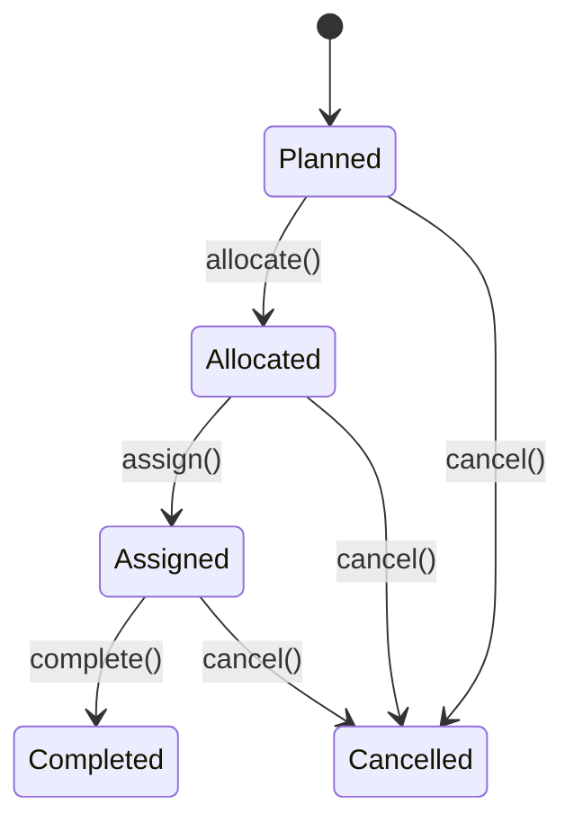

# ADR 0001: Use Typestate Encoding for Domain Aggregates

## Status

Accepted

## Context

Domain aggregates in a WES model state machines (e.g., a task moves through Planned → Allocated → Assigned → Completed). The question is how to enforce valid transitions.

**Options considered:**

1. **Status enum + runtime checks**: A single class with a `status` field. Transition methods check the current status and throw/return errors for invalid transitions.
2. **Typestate encoding**: Each state is a separate case class. Transition methods only exist on valid source states. The compiler prevents illegal transitions.

## Decision

Use typestate encoding. Each aggregate state is a distinct case class nested in the companion object. Transition methods return `(NewState, Event)` tuples.

Example (Task aggregate):

Each arrow corresponds to a method that only exists on the source state's case class.

## Consequences

**Benefits:**

- Illegal state transitions are compile-time errors, not runtime bugs
- Each state can carry only the data relevant to that state
- Pattern matching on states is exhaustive; the compiler warns about unhandled cases
- Transition methods are self-documenting: if a method exists on a type, the transition is valid

**Tradeoffs:**

- More boilerplate than a single class with a status field
- Repositories must handle multiple concrete types per aggregate
- Adding a new state requires touching more places
