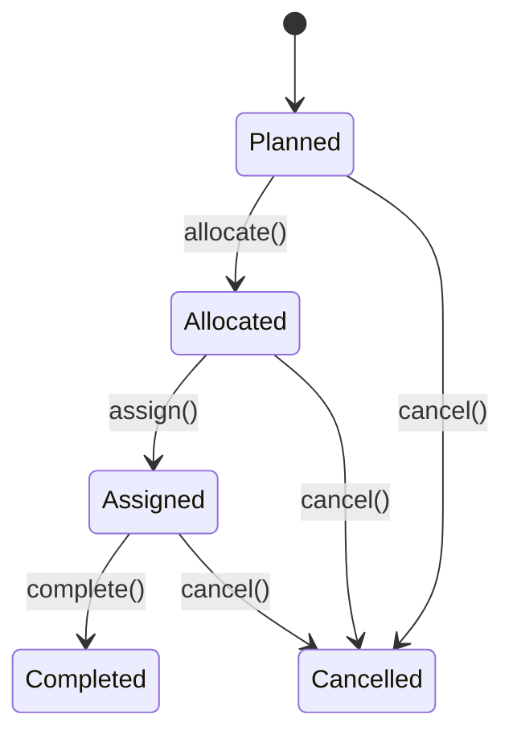

# Use typestate encoding for domain aggregates

## Context and Problem Statement

Domain aggregates in a WES model state machines: a task moves through Planned → Allocated → Assigned → Completed, a wave through Planned → Released → Completed, and so on. Each transition is valid only from specific source states. How do we enforce valid transitions, so that an illegal transition (e.g., completing a task that was never assigned) is impossible to express rather than merely rejected at runtime?

## Decision Drivers

- Illegal state transitions should be caught at compile time, not discovered as runtime bugs.
- Each state should carry only the data relevant to that state, not a union of every field across the lifecycle.
- Pattern matching over states should be exhaustive, with compiler warnings for unhandled cases.
- Transitions should be self-documenting: the set of methods on a state should be the set of legal moves.

## Considered Options

- **Typestate encoding** — each state is a distinct case class; transition methods exist only on valid source states.
- **Status enum + runtime checks** — a single class with a `status` field; transition methods inspect the status and throw or return an error for invalid transitions.

## Decision Outcome

Chosen option: **"Typestate encoding"**, because it pushes the state machine into the type system: an illegal transition is a method that does not exist on the source state, so the compiler rejects it before the program runs. Each aggregate state is a distinct case class nested in the companion object, and transition methods return `(NewState, Event)` tuples.

Example (Task aggregate):

Each arrow corresponds to a method that only exists on the source state's case class.

### Consequences

- **Good**, because illegal state transitions are compile-time errors, not runtime bugs.
- **Good**, because each state can carry only the data relevant to that state.
- **Good**, because pattern matching on states is exhaustive; the compiler warns about unhandled cases.
- **Good**, because transition methods are self-documenting: if a method exists on a type, the transition is valid.
- **Bad**, because there is more boilerplate than a single class with a status field.
- **Bad**, because repositories must handle multiple concrete types per aggregate.
- **Neutral**, because adding a new state requires touching more places — a cost that doubles as a checklist of everything the new state affects.

### Confirmation

Enforced by the Scala compiler: calling a transition method that does not exist on a state fails to compile, and exhaustiveness checking on `match` over the sealed trait flags any unhandled state. No runtime fitness function is required — the type system *is* the fitness function.

## Pros and Cons of the Options

### Typestate encoding

- **Good**, because invalid transitions are unrepresentable (compile-time), not merely guarded (runtime).
- **Good**, because state-specific data lives only on the state that needs it.
- **Good**, because exhaustive matching over the sealed trait is compiler-checked.
- **Bad**, because it is more verbose, and repositories must persist and reconstruct multiple concrete types per aggregate.

### Status enum + runtime checks

- **Good**, because it is minimal: one class per aggregate, one type for repositories to handle.
- **Bad**, because invalid transitions are caught only at runtime, as thrown exceptions or error returns.
- **Bad**, because every state carries every field across the whole lifecycle, forcing optionality and defensive checks for data that is only valid in some states.

## More Information

- Architecture overview: [`docs/architecture.md`](../architecture.md), "Typestate-Encoded Aggregates".
- Walkthrough with full source: [Chapter 4 — Typestates](../book/02-the-domain-model/ch04-typestates.md).
- The paired events are covered in [Chapter 5 — Events](../book/02-the-domain-model/ch05-events.md).
